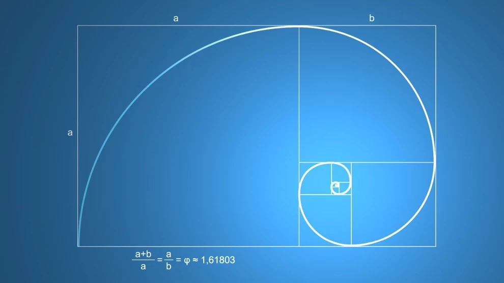

# 1.3.1 Exemplo Simples

Nesta seção, apresentamos um exemplo simples do ciclo apresentado na [Seção 1.3](./), utilizando a especificação da sequência de Fibonacci, utilizando por [Kent Beck \(2003\)](https://www.amazon.com.br/Test-Driven-Development-Kent-Beck/dp/0321146530).

Considere a especificação do problema da sequência de Fibonacci apresentada a seguir:

> A sequência de Fibonacci é constituída da seguinte forma: 1 1 2 3 5 8 13 21 34 55 e assim por diante. Nela, está presente o seguinte padrão. Um mais um igual a dois. Um mais dois é igual a três. Dois mais três são iguais a cinco. E assim por diante. Ou seja, o sucessor de um número na sequência é formada pela soma dos dois números anteriores a ele.
>
> Todo número na série Fibonacci é de aproximadamente 0,618 a 1 em termos de sua relação com o número após ele. Essa proporção nunca muda porque a proporção permanece a mesma. O interessante da sequência é que ela gera a chamada espiral perfeita, conforme ilustrado na imagem abaixo. \(Fonte: [https://www.ambroker.com/pt/analysis/blog/sequencia-de-fibonacci/](https://www.ambroker.com/pt/analysis/blog/sequencia-de-fibonacci/)\)



Desse modo, suponha que fossemos implementar uma classe com exemplos matemáticos e um desses exemplos fosse um método que gerasse a sequência de Fibonacci. O código completo do exemplo apresentado abaixo está disponível no GitHub no endereço [https://github.com/aurimrv/fibonacci](https://github.com/aurimrv/fibonacci). Os arquivos foram numerados sequenciamente para facilitar a apresentação das mudanças implementadas nos testes e na aplicação em si.

### Primeira Rodada do Ciclo de TDD

#### 1º Passo do Ciclo TDD - Escreva um Teste que Falhe

Ao aplicar TDD para essa construção, iniciaríamos a escrita de um caso de teste \(`test01.py`\) que representaria uma história de usuário conforme ilustrado abaixo:

```text
import unittest
from math_samples01 import MathSamples

class FibonacciTest(unittest.TestCase):

    def test_fib01(self):
    	self.assertEqual(MathSamples.fibonacci(0), 0)
```

O exemplo acima, ilustra o uso de um framework de execução de testes em Python denominado [UnitTest](https://docs.python.org/pt-br/3/library/unittest.html). Precisamos dele para conduzir a execução automática de nossos testes. É importante observar que ele não é o único existente para tal finalizade. Temos muitos outros disponíveis para Python.

Vamos destrinchar o código acima. Inicialmente, na linha 1, indicamos que iremos fazer uso do `unittest`. Em seguida, na linha 2, o teste indica que estamos assumindo a existência de um pacote math\_samples01 que possui dentro dele uma classe denominada `MathSamples`. Em seguida, na linha 4, é criada uma classe, denominada `FibonacciTest` a qual estende a classe `unittest.TestCase` do framework UnitTest. Na linha 6 é criado um método que representa um caso de teste. Métodos que representam casos de teste devem ter o nome iniciado com `test_` pois é desse modo que o frameword identifica quais métodos ele deve executar automaticamente. Finalmente, na linha 7, o método desejado é invocado com o valor `0` \(`MathSamples.fibonacci(0)`\). Conforme a definição, por definição, o valor da sequência de Fibonacci para o valor de `n=0` deveria ser `0`. Assim, o método `self.assertEquals` do framework recebe dois parâmetros que permitem realizar uma comparação do valor obtido com a exeção do método da aplicação com o valor esperado conforme a especificação.

A prtir do relato acima, observa-se que o caso de teste está guiando a escrita da aplicação. Ou seja, para fazer esse teste passar, os pré-requisitos demandados pelo mesmo devem ser implementados para que o interpretador Python não acuse erros de sintaxe por não encontrar os elementos do qual o teste depende. Assim sendo, antes de executar o teste acima, construímos o esqueleto da implementação da classe `MathSamples` que, conforme pode ser observado no teste, tem o método estático `fibonacci` que aceita um número como argumento. Essa classe poderia ser especificada conforme abaixo e salva no arquivo chamado de `math_samples01.py`, salva no mesmo diretório do arquivo `test01.py`.

```text
class MathSamples:
	@staticmethod
	def fibonacci(n):
		pass;
```

Para a execução dos testes, basta executar o comando abaixo:

```text
$ python -m unittest tests01.py 
F
======================================================================
FAIL: test_fib01 (tests01.FibonacciTest)
----------------------------------------------------------------------
Traceback (most recent call last):
  File "/home/auri/insync/tdd/fibonacci/tests01.py", line 7, in test_fib01
    self.assertEqual(MathSamples.fibonacci(0), 0)
AssertionError: None != 0

----------------------------------------------------------------------
Ran 1 test in 0.000s

FAILED (failures=1)
```

Como era de se esperar, o teste falhou pois a classe em teste ainda não implementa a funcionalidade capaz de fazer o teste passar.

#### 2º Passo do Ciclo TDD - Escreva um Código para Passar o Teste

Em seguida, para passar o teste, iremos iniciar a escrita do código funcional da aplição de modo a fazer o teste passar. Segundo [Beck \(2003\)](https://www.amazon.com.br/Test-Driven-Development-Kent-Beck/dp/0321146530), devemos perder aqui a menor quantidade de tempo possível para fazer o teste passar. Haverá o momento para melhorias. Por hora, a intenção é apenas a de fazer o teste passar com o menor esforço possível. A nova versão do método `fibonacci` da classe `MathSamples`, abaixo \(arquivo `math_samples02.py`\), tem esse objetivo.

```text
class MathSamples:
	@staticmethod
	def fibonacci(n):
		return 0;
```

Observamos que nela, a única alteração  foi a de remover o comando `pass` e o substituir por um `return 0` \(linha 4\). Desse modo, ao repetir a execução do teste \(arquivo `test02.py`\), ele irá passar, conforme apresentado a seguir.

```text
$ python -m unittest tests02.py 
.
----------------------------------------------------------------------
Ran 1 test in 0.000s

OK
```

#### 3º Passo do Ciclo TDD - Eliminar Redundância

Como o código do método `fibonacci` da classe `MathSamples` ainda é bem simples, não há necessidade de execução do passo 3 nesse momento e, desse modo, retonar-se ao 1º passo do ciclo para a escrita de mais testes.

### Segunda Rodada do Ciclo de TDD

#### 1º Passo do Ciclo TDD - Escreva um Teste que Falhe

O próximo teste, explora o segundo número da sequência de Fibonacci. Agora, nosso arquivo de teste, nomeado de `test03.py`, apresenta o conteúdo abaixo:

```text
import unittest
from math_samples03 import MathSamples

class FibonacciTest(unittest.TestCase):

    def test_fib01(self):
    	ms = MathSamples()
    	self.assertEqual(ms.fibonacci(0), 0)

    def test_fib02(self):
    	ms = MathSamples()
    	self.assertEqual(ms.fibonacci(1), 1)
```

Ao executar os testes, o segundo \(`test_fib02`\) irá falhar, conforme ilustrado abaixo. Ou seja, `fibonacci(1)`, conforme nossa definição, é `1` e o código atual retorna `0`.

```text
$ python -m unittest tests03.py 
.F
======================================================================
FAIL: test_fib02 (tests03.FibonacciTest)
----------------------------------------------------------------------
Traceback (most recent call last):
  File "/home/auri/insync/tdd/fibonacci/tests03.py", line 12, in test_fib02
    self.assertEqual(ms.fibonacci(1), 1)
AssertionError: 0 != 1

----------------------------------------------------------------------
Ran 2 tests in 0.000s

FAILED (failures=1)
```

#### 2º Passo do Ciclo TDD - Escreva um Código para Passar o Teste

Escrevendo o código que faça o teste passar, a implementação do nosso método `fibonacci` , fica como se segue \(arquivo `math_samples04.py`\):

```text
class MathSamples:
	def fibonacci(self, n):
		if(n == 0):
			return 0
		return 1;
```

E agora, ao executar os testes \(arquivo `test04.py`\) para essa implementação, ambos os testes passam:

```text
$ python -m unittest tests04.py 
..
----------------------------------------------------------------------
Ran 2 tests in 0.000s

OK
```

#### 3º Passo do Ciclo TDD - Eliminar Redundância

Como o código do método `fibonacci` da classe `MathSamples` ainda é bem simples, não há necessidade de execução do passo 3 nesse momento e, desse modo, retonar-se ao 1º passo do ciclo para a escrita de mais testes.

### Terceira Rodada do Ciclo de TDD

#### 1º Passo do Ciclo TDD - Escreva um Teste que Falhe

O próximo teste, explora o segundo número da sequência de Fibonacci. Agora, nosso arquivo de teste, nomeado de `test05.py`, apresenta o conteúdo abaixo:

```text
import unittest
from math_samples05 import MathSamples

class FibonacciTest(unittest.TestCase):

    def test_fib01(self):
    	ms = MathSamples()
    	self.assertEqual(ms.fibonacci(0), 0)

    def test_fib02(self):
    	ms = MathSamples()
    	self.assertEqual(ms.fibonacci(1), 1)

    def test_fib03(self):
    	ms = MathSamples()
    	self.assertEqual(ms.fibonacci(2), 1)
```

Ao executar esse teste na implementação `math_samples05.py` obtemos o resultado abaixo, ou seja, surpreendentemente, o nosso código responde adequadamente para esse novo teste, sem que seja necessário qualquer alteração pois, `fibonacci(2)` é `1`, conforme nossa especificação e é assim que a aplicação se comporta:

```text
$ python -m unittest tests05.py 
...
----------------------------------------------------------------------
Ran 3 tests in 0.000s

OK
```

Escrevemos, então, mais um teste, agora para o quarto número da sequência, ou seja, `fibonacci(3)`, o qual deveria ser `2` \(arquivo `teste06.py`, abaixo\)

```text
import unittest
from math_samples06 import MathSamples

class FibonacciTest(unittest.TestCase):

    def test_fib01(self):
    	ms = MathSamples()
    	self.assertEqual(ms.fibonacci(0), 0)

    def test_fib02(self):
    	ms = MathSamples()
    	self.assertEqual(ms.fibonacci(1), 1)

    def test_fib03(self):
    	ms = MathSamples()
    	self.assertEqual(ms.fibonacci(2), 1)

    def test_fib04(self):
    	ms = MathSamples()
    	self.assertEqual(ms.fibonacci(3), 2)
```

Ao executar o teste, a aplicação não se comporta corretamente, conforme apresentado a seguir.

```text
$ python -m unittest tests06.py 
...F
======================================================================
FAIL: test_fib04 (tests06.FibonacciTest)
----------------------------------------------------------------------
Traceback (most recent call last):
  File "/home/auri/insync/tdd/fibonacci/tests06.py", line 20, in test_fib04
    self.assertEqual(ms.fibonacci(3), 2)
AssertionError: 1 != 2

----------------------------------------------------------------------
Ran 4 tests in 0.000s

FAILED (failures=1)
```

#### 2º Passo do Ciclo TDD - Escreva um Código para Passar o Teste

Escrevendo o código que faça o teste passar, a implementação do nosso método `fibonacci` , fica como se segue \(arquivo `math_samples07.py`\):

```text
class MathSamples:
	def fibonacci(self, n):
		if(n == 0):
			return 0
		if(n <= 2):
			return 1;
		return 1 + 1;
```

Após a correção, ao executar o conjunto de teste \(arquivo `teste07.py`\), todos eles passam:

```text
$ python -m unittest tests07.py 
....
----------------------------------------------------------------------
Ran 4 tests in 0.000s

OK
```

#### 3º Passo do Ciclo TDD - Eliminar Redundância

Nesse momento, é possível observar o código e eliminar redundância uma vez que, ao retornar `1 + 1`, têm-se que esses valores já eram retornados quando se calculou o `fibonacci(2)` e `fibonacci(1)`, ambos retornavam `1`.

Desse modo, o primeiro `1` do return, poderia ser substituído por uma chamada recursiva a `fibonacci(n-1)` \(arquivo `math_samples08.py`\).

```text
class MathSamples:
	def fibonacci(self, n):
		if(n == 0):
			return 0
		if(n <= 2):
			return 1;
		return self.fibonacci(n-1) + 1;
```

Em seguida, o segundo 1 pode ser substituído por `fibonacci(n-2)`, conforme código abaixo \(arquivo `math_samples09.py`\).

```text
class MathSamples:
	def fibonacci(self, n):
		if(n == 0):
			return 0
		if(n <= 2):
			return 1;
		return self.fibonacci(n-1) + self.fibonacci(n-2);
```

Após as melhorias, o conjunto de teste \(arquivo `tests09.py`\) é executado com sucesso, encerrando o ciclo TDD. Obviamente, novos testes podem ser redigidos para verificar se continua funcional.

```text
$ python -m unittest tests09.py 
....
----------------------------------------------------------------------
Ran 4 tests in 0.000s

OK
```


