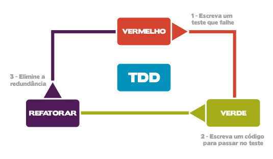

# 1.3 TDD Básico

Conforme definido por [Kent Beck \(2003\)](https://www.amazon.com.br/Test-Driven-Development-Kent-Beck/dp/0321146530), o TDD nada mais é do que um estilo de desenvolvimento incremental.O ciclo do TDD consiste de:

1. **Escrever um teste \(Vermelho\)**. Imagine como a operação seria executada em sua mente em função de alguma entrada fornecida. Na terminologia de métodos ágeis, você deve pensar que está escrevendo uma história. Imagine qual interface seria necessária e inclua todos os elementos na história que seriam necessários para que a resposta fosse fornecida ao executar a interface imaginada. A analogia aqui com o ciclo Vermelho da figura abaixo, extraída de [Rocha \(2013\)](https://www.devmedia.com.br/tdd-fundamentos-do-desenvolvimento-orientado-a-testes/28151), ou seja, os testes ainda não passam por não ter código implementado que corresponda à funcionalidade idealizada.
2. **Fazer funcionar \(Verde\)**. A intenção nessa etapa é escrever o código necessário para fazer o teste passar. Se há uma solução simples e óbvia para isso, ótimo. Utilize-a. Por outro lado, se a solução é simples e óbvia, mas levará algum tempo até codificá-la, prefira fazer o teste passar mais rapidamente. Nem sempre essa mudança de mentalidade é fácil de ser seguida, principalmente por programadores experientes. Mas o importante aqui é fazer os testes passarem rapidamente. No passo seguinte, as melhorias irão ocorrer. 
3. **Fazer a coisa certa \(Roxo\)**. Agora que o sistema se comporta conforme o esperado é o momento de refatorar o código, eliminando redundância e aplicando as boas práticas de engenharia de software.

Desse modo, observamos que o TDD enfatiza uma estratégia de desenvolvimento e integração _botton-up_, ou seja, de unidades menores para as maiores \([Beck, 2003](https://www.amazon.com.br/Test-Driven-Development-Kent-Beck/dp/0321146530)\). Essa estratégia minimiza, por exemplo, a necessidade de [Mock Objects](https://blog.cleancoder.com/uncle-bob/2014/05/10/WhenToMock.html), facilitando o teste da aplicação no seu contexto.

