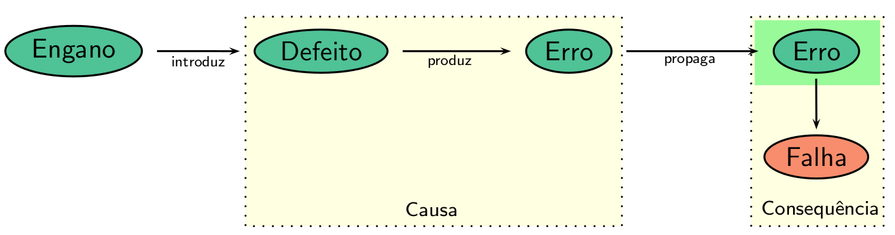

# 2.2 Terminologia e Conceitos Básicos

A IEEE tem realizado vários esforços de padronização, entre eles para padronizar a terminologia utilizada no contexto de Engenharia de Software. O padrão [ISO/IEC/IEEE 24765-2017](https://ieeexplore.ieee.org/document/8016712) diferencia os termos: **defeito** \(_fault_\) – passo, processo ou definição de dados incorreto, como por exemplo, uma instrução ou comando incorreto; **engano** \(_mistake_\) – ação humana que produz um resultado incorreto, com por exemplo, uma ação incorreta tomada pelo programador; **erro** \(_error_\) – diferença entre o valor obtido e o valor esperado, ou seja, qualquer estado intermediário incorreto ou resultado inesperado na execução do programa constitui um erro; e **falha** \(_failure_\) – produção de uma saída incorreta com relação à especificação. 

A figura abaixo ilustra o relacionamento entre os termos, sendo o defeito e o erro considerados a causa e a falha, a consequência. 

De uma forma geral, os defeitos são classificados em: **defeitos computacionais** – o defeito provoca uma computação incorreta mas o caminho executado \(sequências de comandos\) é igual ao caminho esperado; e **defeitos de domínio** – o caminho efetivamente executado é diferente do caminho esperado, ou seja, um caminho incorreto é selecionado.

A atividade de teste é permeada por uma série de limitações \([Delamaro et al. 2016](https://www.grupogen.com.br/e-book-introducao-ao-teste-de-software)\). Em geral, os seguintes problemas são indecidíveis: dados dois programas, se eles são equivalentes; dados duas sequências de comandos \(caminhos\) de um programa, ou de programas diferentes, se eles computam a mesma função; e dado um caminho se ele é executável ou não, ou seja, se existe um dado de entrada que leva à execução desse caminho. Outra limitação fundamental é a correção coincidente – o programa pode apresentar, coincidentemente, um resultado correto para um item particular de um dado _d_ ∈ _D_, ou seja, um particular item de dado ser executado, satisfazer a um requisito de teste e não faz o software falhar.

Diz-se que um programa _P_ com domínio de entrada _D_ é correto com respeito a uma especificação _S_ se _S_\(_d_\) = _P_\(_d_\) para qualquer item de dado _d_ pertencente a _D_, ou seja, se o comportamento do programa está de acordo com o comportamento esperado para todos os dados de entrada. Dados dois programas _P_\__1  e P\_2_, se

