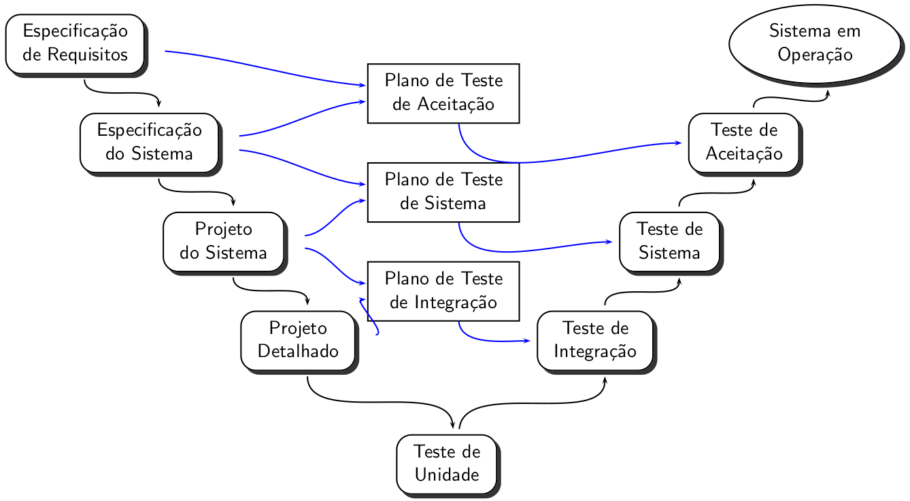
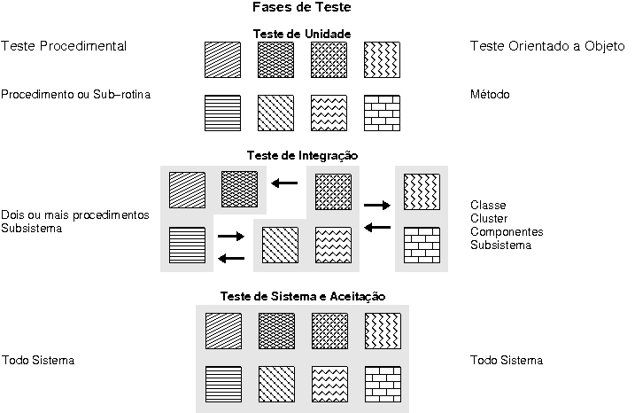
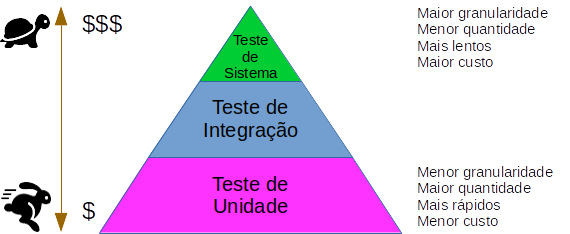

# 2.3 Fases de Teste

O teste de produtos de software envolve basicamente quatro etapas: planejamento de testes, projeto de casos de teste, execução e avaliação dos resultados dos testes \([Delamaro et al. 2016](https://www.grupogen.com.br/e-book-introducao-ao-teste-de-software)\). Essas atividades devem ser desenvolvidas ao longo do próprio processo de desenvolvimento de software, e em geral, concretizam-se em três fases de teste: de unidade, de integração e de sistema. 

Um modelo clássico, denominado Modelo-V, alinha as atividades de desenvolvimento com as atividades de teste.

O **teste de unidade** concentra esforços na menor unidade do projeto de software, ou seja, procura identificar defeitos de lógica e de implementação em cada módulo do software, separadamente. 

O **teste de integração** é uma atividade sistemática aplicada durante a integração da estrutura do programa visando a descobrir erros associados às interfaces entre os módulos; o objetivo é, a partir dos módulos testados no nível de unidade, construir a estrutura de programa que foi determinada pelo projeto. 

O **teste de sistema**, realizado após a integração do sistema, visa a identificar erros de funções e características de desempenho que não estejam de acordo com a especificação.

O **teste de aceitação** é aquele realizado pelo usuário para se assegurar de que o produto desenvolvido atende suas necessidades.

Nos últimos anos, muito em decorrência da adoção de métodos ágeis ou de parte das práticas ágeis, houve uma demanda por automatização de teste de software. Entretanto, a grande maioria das empresas, quando iniciam o processo de automatização, em geral, o fazem para executar o sistema como um todo, ou seja, no nível de sistema. O problema é que testes automatizados no nível de sistema tendem a apresentar mais vantagens do que desvantagens pois demandam mais código para a automatização, constumam executar lentamente, e precisam de manutenção sempre que ocorre mudanças na interface do produto.

O ideal seria que a automatização respeitasse a pirâmide de teste, conforme descrita por [Vocke \(2018\)](https://martinfowler.com/articles/practical-test-pyramid.html). Um exemplo da Pirâmide de Teste, inspirada no artigo citado é dado abaixo.

A pirâmide sugere que a maior quantidade de testes automatizados deve ser de testes unitários, seguidos de uma porção menos de testes de integração e uma porção menor ainda de testes de sistemas. Segundo [Whittaker et al. \(2012\)](https://dl.acm.org/doi/book/10.5555/2207802), recomendação geral é que esses três testes sejam implementados na seguinte proporção: 70% como testes de unidades; 20% como testes de integração e 10% como testes de sistema.

De toda forma, o que não pode deixar de ser feito é não se testar. O TDD prega que os testes devem ser construídos antes de se construir a aplicação e, desse modo, os testes estarão garantidos para assegurar a qualidade da aplicação desde o início e funcionam como um importante instrumento para se evitar que defeitos ocasionais quebrem a aplicação sem serem descobertos rapidamente. Em outras palavras, o TDD oferece um _feedback_ instantâneo a cada mudança implementada.

