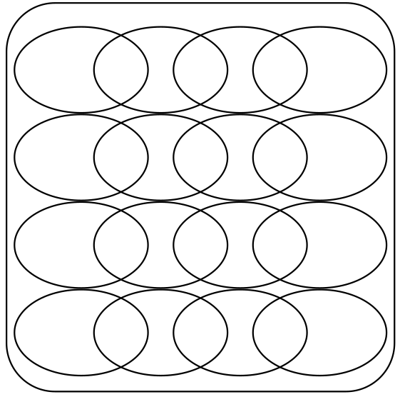
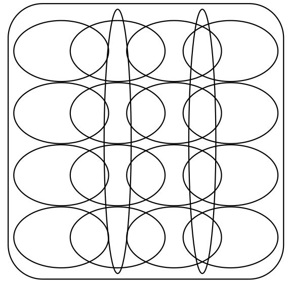

# 2.4 Técnicas e Critérios de Teste

Para se conduzir e avaliar a qualidade da atividade de teste têm-se as técnicas de teste funcional, estrutural e baseada em defeitos \([Delamaro et al. 2016](https://www.grupogen.com.br/e-book-introducao-ao-teste-de-software)\). Tais técnicas diferenciam-se pela origem da informação utilizada na avaliação e construção dos conjuntos de teste.

* Na **técnica funcional**, os critérios e requisitos de teste são estabelecidos a partir da função de especificação do software; 
* Na **técnica estrutural**, os critérios e requisitos são derivados essencialmente a partir das características de uma particular implementação em teste; e
* Na **técnica baseada em defeitos**, os critérios e requisitos de teste são oriundos do conhecimento sobre defeitos típicos cometidos no processo de desenvolvimento de software.

A figura a seguir ilustra o relacionamento entre técnica, critério, requisito e caso de teste.


Independentemente de qual técnica determinado critério pertence, o papel de todo e qualquer critério de teste é derivar requisitos de teste que de forma direta ou indireta, particionam o domínio de entrada do produto em teste, forçando o testador a selecionar ao menos um elemento de cada subdomínio pra poder satisfazer o critério em questão. Desse modo, critérios mais rigorosos particionam mais o domínio de entrada do que critérios menos rigorosos. As figuras abaixo, adaptada de [Pezzè e Young \(2007\)](https://www.amazon.com/exec/obidos/ASIN/0471455938/acmorg-20) ilustram a segmentação ocacionada por diferentes critérios de teste supostamente dos menos rigorosos \(a\) para os mais rigorosos \(e\).

|   |   |
| :---: | :---: |
| \(a\) | \(b\) |
|   |   |
| \(c\) | \(d\) |


Neste texto será dado ênfase à técnica de teste funcional e alguns de seus critérios. Para ilustrar a aplicação dos critérios de teste será utilizada a especificação de um programa simples, parte de um compilador, denominado `Identifier`. A especificação do referido programa é dada abaixo:

```text
###############################################################################
# Especificação Identifier.py
# ---------------------------
#
# O programa deve determinar se um identificador é ou não valido em 
# ’Silly Pascal’ (uma estranha variante do Pascal).
#
# Um identificador válido deve começar com uma letra e conter apenas letras 
# ou dígitos. Caracteres acentuados não são válidos.
#
# Além disso, deve ter no mínimo 1 e no máximo 6 caracteres de comprimento.
###############################################################################
```

## Técnica Funcional

O teste funcional também é conhecido como teste caixa preta pelo fato de tratar o software como uma caixa cujo conteúdo é desconhecido e da qual só é possível visualizar o lado externo, ou seja, os dados de entrada fornecidos e as respostas produzidas como saída \([Delamaro et al. 2016](https://www.grupogen.com.br/e-book-introducao-ao-teste-de-software)\). Na técnica de teste funcional são verificadas as funções do sistema sem se preocupar com os detalhes de implementação. 

O teste funcional envolve dois passos principais: identificar as funções que o software deve realizar e criar casos de teste capazes de checar se essas funções são realizadas pelo software \([Delamaro et al. 2016](https://www.grupogen.com.br/e-book-introducao-ao-teste-de-software)\). As funções que o software deve possuir são identificadas a partir de sua especificação. Assim, uma especificação bem elaborada e de acordo com os requisitos do usuário é essencial para esse tipo de teste. 

Dois dos critérios funcionais mais conhecidos são:

* **Particionamento em Classes de Equivalência**: a partir das condições de entrada de dados identificadas na especificação, divide-se o domínio de entrada de um programa em classes de equivalência válidas e inválidas. Em seguida seleciona-se o menor número possível de casos de teste, baseando-se na hipótese que um elemento de uma dada classe seria representativo da classe toda, sendo que para cada uma das classes inválidas deve ser gerado um caso de teste distinto. O uso de particionamento permite examinar os requisitos mais sistematicamente e restringir o número de casos de teste existentes. Alguns autores também consideram o domínio de saída do programa para estabelecer as classes de equivalência.
* **Análise do Valor Limite**: é um complemento ao critério Particionamento em Classes de Equivalência, sendo que os limites associados às condições de entrada são exercitados de forma mais rigorosa; ao invés de selecionar-se qualquer elemento de uma classe, os casos de teste são escolhidos nas fronteiras das classes, pois nesses pontos se concentra um grande número de erros. O espaço de saída do programa também é particionado e são exigidos casos de teste que produzam resultados nos limites dessas classes de saída.

Um dos problemas relacionado aos critérios funcionais é que muitas vezes a especificação do programa é feita de modo descritivo e não formal. Dessa maneira, os requisitos de teste derivados de tais especificações são também, de certa forma, imprecisos e informais. Como consequência, tem-se dificuldade em automatizar a aplicação de tais critérios, que ficam, em geral, restritos à aplicação manual. Por outro lado, para a aplicação desses critérios é essencial apenas que se identifiquem as entradas, a função a ser computada e a saída do programa, o que os tornam aplicáveis praticamente em todas fases de teste \(unidade, integração e sistema\). No caso do TDD, essa é a técnica de teste mais utilizada pois é sempre a partir do entendimento da especificação do que será construído que os testes são desenvolvidos \([Percival, 2017](http://www.obeythetestinggoat.com/pages/book.html)\).

