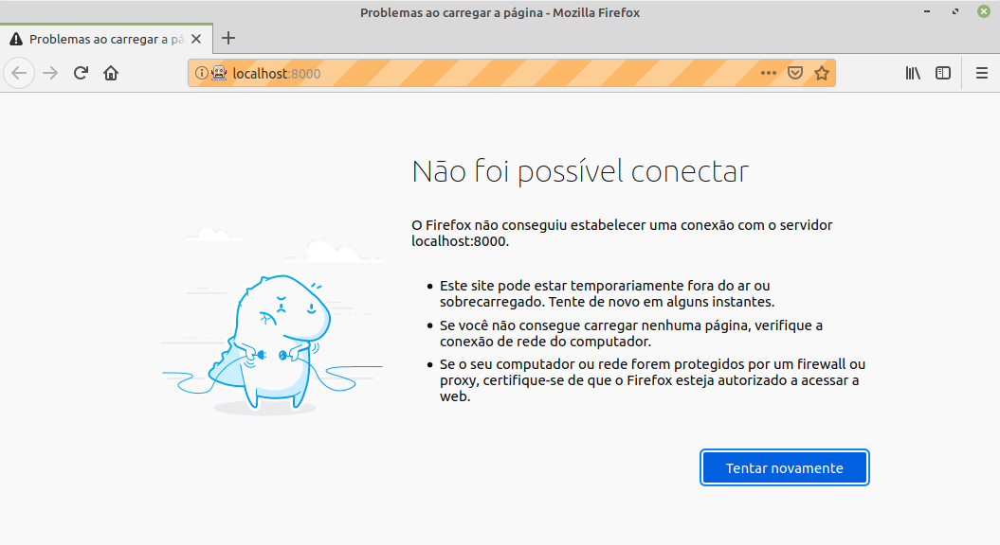
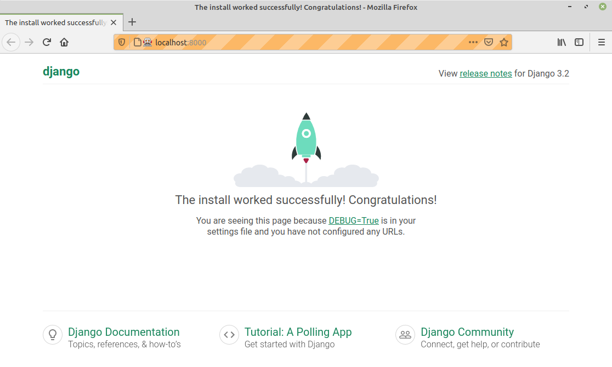

# 3.2 Verificando o Ambiente com TDD

Conforme ressalta [Percival \(2017\)](http://www.obeythetestinggoat.com/pages/book.html), utilizar o estilo de programação do TDD pode não ser algo que surja naturalmente e é importante não desistir quando surgirem as primeiras dificuldades e/ou dúvidas quanto ao seu uso. 

A ideia geral é de que nada seja feito sem que exista um teste para verificar o funcionamento de tudo. Por exemplo, sabendo que nossa aplicação irá executar no `django`, podemos redigir um teste para nos certificarmos de que o `django` esteja ativo e pronto para ser utilizado.

Para isso, podemos escrever um teste conforme apresentado abaixo:

```text
from selenium import webdriver

browser = webdriver.Firefox()
browser.get("http://localhost:8000")

assert 'Django' in browser.title
```

Esse teste deve ser salvo num arquivo `functional_tests.py` dentro da pasta `$HOME/tdd/superlists`. 

Feito isso, é possível executar o teste com o comando abaixo:

```text
(superlists) auri@av:~/tdd/superlists$ python functional_tests.py 
Traceback (most recent call last):
  File "functional_tests.py", line 4, in <module>
    browser.get("http://localhost:8000")
  File "/home/auri/insync/tdd/superlists/lib/python3.8/site-packages/selenium/webdriver/remote/webdriver.py", line 333, in get
    self.execute(Command.GET, {'url': url})
  File "/home/auri/insync/tdd/superlists/lib/python3.8/site-packages/selenium/webdriver/remote/webdriver.py", line 321, in execute
    self.error_handler.check_response(response)
  File "/home/auri/insync/tdd/superlists/lib/python3.8/site-packages/selenium/webdriver/remote/errorhandler.py", line 242, in check_response
    raise exception_class(message, screen, stacktrace)
selenium.common.exceptions.WebDriverException: Message: Reached error page: about:neterror?e=connectionFailure&u=http%3A//localhost%3A8000/&c=UTF-8&d=O%20Firefox%20n%C3%A3o%20conseguiu%20estabelecer%20uma%20conex%C3%A3o%20com%20o%20servidor%20localhost%3A8000.
```

A execução do teste causa a abertura de uma janela do Firefox com uma mensagem de erro, conforme ilustrado abaixo:



Como era de se esperar, o teste falhou, exatamente por não conseguir encontrar uma instância ativa do `django` em execução.

#### Fazendo o teste passar

Para fazermos o teste passar é necessário colocarmos uma instância do `django` em execução. Para isso, o primeiro passo é a criação de um **projeto** que será o contêiner principal de nosso site. A criação de um projeto em `django` pode ser feita com a ferramenta `django-admin`. O comando abaixo, executado dentro da pasta `superlists` do nosso ambiente virtual, irá criar esse projeto para nós.

```text
(superlists) auri@av:~/tdd/superlists$ django-admin startproject superlists
(superlists) auri@av:~/tdd/superlists$ 
```

Em caso de sucesso, o comando não emite qualquer saída, mas irá criar um subdiretório `superlists` abaixo do diretório corrente. Parte da estrutura de diretórios do ambiente virtual com o projeto do `django` fica conforme apresentado na figura abaixo:

```text
(superlists) auri@av:~/tdd/superlists$ tree -L 3 .
.
├── bin
│   ├── activate
│   ├── activate.csh
│   ├── activate.fish
│   ├── activate.ps1
│   ├── activate_this.py
│   ├── activate.xsh
│   ├── django-admin
│   ├── django-admin.py
│   ├── get_env_details
│   ├── pip
│   ├── pip3
│   ├── pip3.8
│   ├── postactivate
│   ├── postdeactivate
│   ├── preactivate
│   ├── predeactivate
│   ├── __pycache__
│   │   └── django-admin.cpython-38.pyc
│   ├── python -> python3
│   ├── python3
│   ├── python3.8 -> python3
│   ├── python-config
│   ├── sqlformat
│   └── wheel
├── functional_tests.py
├── geckodriver.log
├── include
│   └── python3.8 -> /usr/include/python3.8
├── lib
│   └── python3.8
...
│       └── _weakrefset.py -> /usr/lib/python3.8/_weakrefset.py
└── superlists
    ├── manage.py
    └── superlists
        ├── asgi.py
        ├── __init__.py
        ├── settings.py
        ├── urls.py
        └── wsgi.py
```

Para inicializar o servidor `django`, basta executar o comando abaixo dentro do ambiente virtual.

```text
(superlists) auri@av:~/tdd/superlists$ cd superlists/
(superlists) auri@av:~/tdd/superlists/superlists$ python manage.py runserver
Watching for file changes with StatReloader
Performing system checks...

System check identified no issues (0 silenced).

You have 18 unapplied migration(s). Your project may not work properly until you apply the migrations for app(s): admin, auth, contenttypes, sessions.
Run 'python manage.py migrate' to apply them.
April 26, 2021 - 23:37:26
Django version 3.2, using settings 'superlists.settings'
Starting development server at http://127.0.0.1:8000/
Quit the server with CONTROL-C
```

No exemplo acima, o `django` alerta que é necessário executar um comando para fazer a migração do projeto. Para isso, pressionamos `CONTROL-C` para interromper a execução do servidor e, em seguida, executamos o comando indicado acima.

```text
^C(superlists) auri@av:~/tdd/superlists/superlists$ python manage.py migrate
Operations to perform:
  Apply all migrations: admin, auth, contenttypes, sessions
Running migrations:
  Applying contenttypes.0001_initial... OK
  Applying auth.0001_initial... OK
  Applying admin.0001_initial... OK
  Applying admin.0002_logentry_remove_auto_add... OK
  Applying admin.0003_logentry_add_action_flag_choices... OK
  Applying contenttypes.0002_remove_content_type_name... OK
  Applying auth.0002_alter_permission_name_max_length... OK
  Applying auth.0003_alter_user_email_max_length... OK
  Applying auth.0004_alter_user_username_opts... OK
  Applying auth.0005_alter_user_last_login_null... OK
  Applying auth.0006_require_contenttypes_0002... OK
  Applying auth.0007_alter_validators_add_error_messages... OK
  Applying auth.0008_alter_user_username_max_length... OK
  Applying auth.0009_alter_user_last_name_max_length... OK
  Applying auth.0010_alter_group_name_max_length... OK
  Applying auth.0011_update_proxy_permissions... OK
  Applying auth.0012_alter_user_first_name_max_length... OK
  Applying sessions.0001_initial... OK

```

Feito isso é possível iniciar novamente o servidor e agora sem qualquer mensagem de aviso.

```text
(superlists) auri@av:~/tdd/superlists/superlists$ python manage.py runserver
Watching for file changes with StatReloader
Performing system checks...

System check identified no issues (0 silenced).
April 26, 2021 - 23:40:46
Django version 3.2, using settings 'superlists.settings'
Starting development server at http://127.0.0.1:8000/
Quit the server with CONTROL-C.

```

Agora com o servidor no ar é possível reexecutar o teste para verificar se o mesmo passa. Para isso, basta abrir um novo terminal, se conectar ao ambiente virtual, entrar no diretório `superlists` \(primeiro nível\) e executar o comando para a execução, conforme abaixo:

```text
auri@av:~$ workon superlists
(superlists) auri@av:~$ cd tdd/superlists
(superlists) auri@av:~/tdd/superlists$ python functional_tests.py 
(superlists) auri@av:~/tdd/superlists$
```

Como consequência da execução, será aberta uma janela do Firefox mas desta vez o servidor `django` será encontrado e o teste irá se comportar conforme o esperado.




