# 3.3 Controle de Versão do Projeto

Sistemas de controle de versão se popularizaram e são ferramentas de fundamental importância na gerência de projetos e gestão de configurações de software.

Um dos mais populares atualmente é o [Git](https://git-scm.com/), que conta com diversas plataformas que o utiliza e oferece outras funcionalidades, como o [GitHub](https://github.com/), por exemplo, que oferece recursos de colaboração entre equipes.

Nesta seção, é apresentado como podemo utilizar o Git para controlar as versões do nosso software em desenvolvimento e integrar tudo no GitHub para facilitar a colaboração em nosso projeto.

#### Iniciando o repositório Git

Para que o Git possa controlar as alterações feitas em nossos arquivo é necessário indicar a ele qual será a pasta que irá corresponder ao nosso repositório local. No nosso exemplo, utilizaremos como base a pasta que contém o arquivo `manage.py`. Ela está localizada em `$WORKON_HOME/superlists/superlists`.

Entretanto, primeiramente vamos mover nosso arquivo de teste \(`functional_tests.py`\) para essa pasta. Atualmente ele está localizado um nível abaixo, em `$WORKON_HOME/superlists`. Em seguida, basta entrar na pasta que sera utilizada como nosso diretório de trabalho, e a qual desejamos colocar sobre controle de versão, para inicializar nosso repositório com o comando `git init`.

```text
(superlists) auri@av:~/tdd/superlists$ pwd
/home/auri/tdd/superlists
(superlists) auri@av:~/tdd/superlists$ mv functional_tests.py superlists/
(superlists) auri@av:~/tdd/superlists$ cd superlists/
(superlists) auri@av:~/tdd/superlists/superlists$ git init .
Initialized empty Git repository in /home/auri/insync/tdd/superlists/superlists/.git/
(superlists) auri@av:~/tdd/superlists/superlists$
```

O próximo passo é decidirmos o que iremos colocar sobre controle de versão. O conteúdo atual da pasta é esse:

```text
(superlists) auri@av:~/tdd/superlists/superlists$ ls
db.sqlite3  functional_tests.py  manage.py  superlists
```

#### Excluindo Arquivo do Controle de Versão

`db.sqlite3` é um arquivo de banco de dados e não queremos que ele seja mantido sobre controle de versão. Também vimos anteriormente o arquivo `geckodriver.log` , que é um arquivo de log de execução do Selenium, e também podemos descartar esse arquivo do controle de versão. Para fazer isso no Git, basta criarmos na raiz do repositório, um arquivo denominado especial denominado `.gitignore`. O seu conteúdo indica ao Git o que deve ser ignorado do controle de versão. Os comandos abaixo foram utilizados para a criação do arquivo `.gitignore`. Você também pode utilizar um editor de texto qualquer para essa mesma finalidade. 

```text
(superlists) auri@av:~/tdd/superlists/superlists$ echo "db.sqlite3" >> .gitignore
(superlists) auri@av:~/tdd/superlists/superlists$ echo "geckodriver.log" >> .gitignore
(superlists) auri@av:~/tdd/superlists/superlists$ cat .gitignore 
db.sqlite3
geckodriver.log
```

#### Adicionando Arquivos ao Controle de Versão

Decidido o que ignorar, os demais arquivos, em princípio, podem ser adicionados ao controle de versão. Para isso, usamos o comando `git add`, conforme abaixo. Para consultar o que foi adicionado ao controle de versão, basta usar o comando `git status`.

```text
(superlists) auri@av:~/tdd/superlists/superlists$ git add .
(superlists) auri@av:~/tdd/superlists/superlists$ git status
No ramo master

No commits yet

Mudanças a serem submetidas:
  (utilize "git rm --cached <arquivo>..." para não apresentar)
	new file:   .gitignore
	new file:   functional_tests.py
	new file:   manage.py
	new file:   superlists/__init__.py
	new file:   superlists/__pycache__/__init__.cpython-38.pyc
	new file:   superlists/__pycache__/settings.cpython-38.pyc
	new file:   superlists/__pycache__/urls.cpython-38.pyc
	new file:   superlists/__pycache__/wsgi.cpython-38.pyc
	new file:   superlists/asgi.py
	new file:   superlists/settings.py
	new file:   superlists/urls.py
	new file:   superlists/wsgi.py
```

Como podemos observar, além dos arquivos `.gitignore`, `functional_tests.py` e `manage.py`, todos os arquivos do subdiretório `superlists` também foram incluídos mas, alguns deles não desejamos colocar sobre controle de versão, como é o caso dos arquivos da pasta `__pycache__`. Para isso, basta pedirmos ao Git que remova tais arquivos do controle de versão e adicionarmos os mesmos no arquivo `.gitignore`, conforme mostrado abaixo.

```text
(superlists) auri@av:~/tdd/superlists/superlists$ git rm -r --cached superlists/__pycache__
rm 'superlists/__pycache__/__init__.cpython-38.pyc'
rm 'superlists/__pycache__/settings.cpython-38.pyc'
rm 'superlists/__pycache__/urls.cpython-38.pyc'
rm 'superlists/__pycache__/wsgi.cpython-38.pyc'
(superlists) auri@av:~/tdd/superlists/superlists$ echo "__pycache__" >> .gitignore 
(superlists) auri@av:~/tdd/superlists/superlists$ echo "*.pyc" >> .gitignore 
```

Verificando o status de nosso repositório tudo parece ok, exceto que como modificamos o arquivo `.gitignore`, ele precisa ser adicionado novamente ao repositório \(linha 22\) e, em seguida, as modificações precisam ser confirmadas com o comando `git commit` \(linha 23\).

```text
(superlists) auri@av:~/tdd/superlists/superlists$ git status
No ramo master

No commits yet

Mudanças a serem submetidas:
  (utilize "git rm --cached <arquivo>..." para não apresentar)
	new file:   .gitignore
	new file:   functional_tests.py
	new file:   manage.py
	new file:   superlists/__init__.py
	new file:   superlists/asgi.py
	new file:   superlists/settings.py
	new file:   superlists/urls.py
	new file:   superlists/wsgi.py

Changes not staged for commit:
  (utilize "git add <arquivo>..." para atualizar o que será submetido)
  (use "git restore <file>..." to discard changes in working directory)
	modified:   .gitignore

(superlists) auri@av:~/tdd/superlists/superlists$ git add .gitignore 
(superlists) auri@av:~/tdd/superlists/superlists$ git commit -m "Repository Creation"
[master (root-commit) e68b75e] Repository Creation
 8 files changed, 210 insertions(+)
 create mode 100644 .gitignore
 create mode 100644 functional_tests.py
 create mode 100755 manage.py
 create mode 100644 superlists/__init__.py
 create mode 100644 superlists/asgi.py
 create mode 100644 superlists/settings.py
 create mode 100644 superlists/urls.py
 create mode 100644 superlists/wsgi.py
(superlists) auri@av:~/tdd/superlists/superlists$ 
```

Observe que ao executar o comando `git commit` utilizamos o parâmetro `-m "<MENSAGEM>"`uma vez que toda confirmação exige uma mensagem explicando as alterações realizadas. Se o parâmetro -m for omitido, o Git irá abrir o editor de texto padrão para que uma mensagem seja digitada. Tais mensagens servem para orientar a equipe sobre quais alterações são propostas pelo referido `commit`. 

#### Sincronizando o Repositório Local com o Repositório Remoto

Até o momento, estamos utilizando a ferramenta Git para gerenciar as mudanças em nossa pasta local, mas podemos sincronizar nosso repositório local com repositórios remotos, na nuvem. Existem diversas alternativas para o caso do Git. Uma das mais populares é o [GitHub](https://github.com/). Nele é possível você ter uma conta gratuita para criação de repositórios. 

Desse modo, para que possamos sincronizar o repositório local com o remoto, é importante que você crie uma conta no [GitHub](https://github.com/) e, após isso, crie um _token_ para permitir que o comando Git se comunique com seu repositório remoto no [GitHub](https://github.com/). 

Assumindo que você já tenha criado sua conta no GitHub, a criação do _token_ pode ser feita clicando sobre sua foto na conta e escolhendo a opção _Settings_, conforme imagem abaixo:

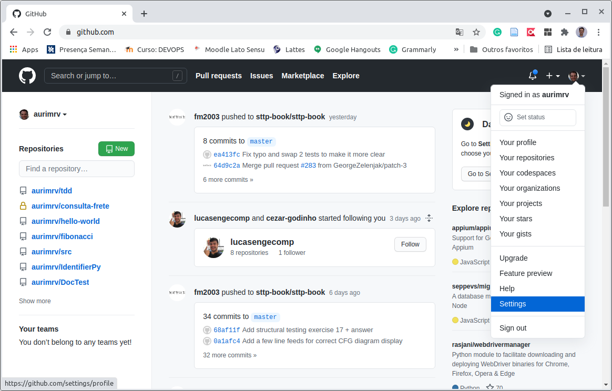

Em seguida, no menu da lateral esquerda, selecione a opção _Developer Settings_.

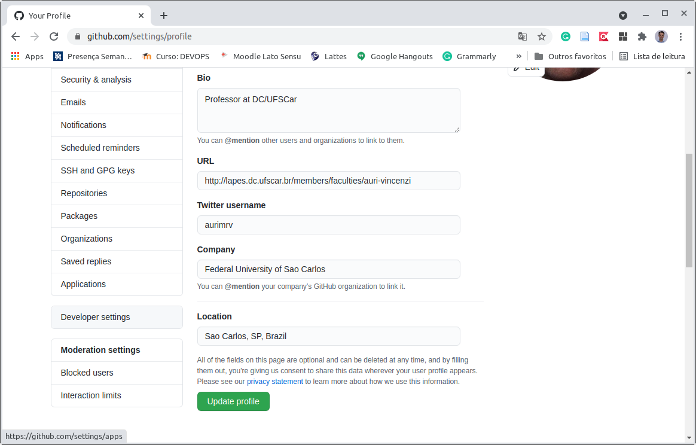

Dentre as opções exibidas, escolha a _Personal Access Token_, e clique em _Generate New Token_.

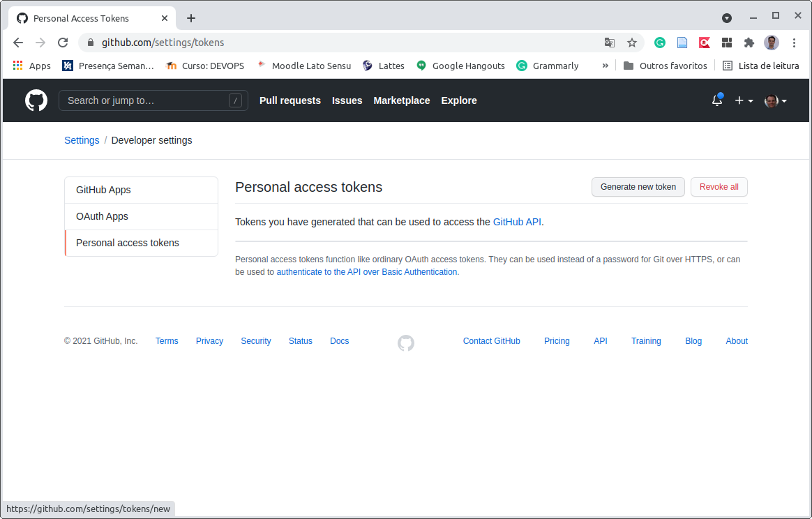

Na janela que irá abrir você deve fornecer um nome qualquer do _token_ \(`TokenCMD` no exemplo abaixo\) e escolher as permissões que o mesmo terá. Para a gestão dos repositórios, basta selecionar o primeiro grupo de permissões \(`repo`\) e, navegar até o final e clicar em _Generete token_, conforme telas a seguir.

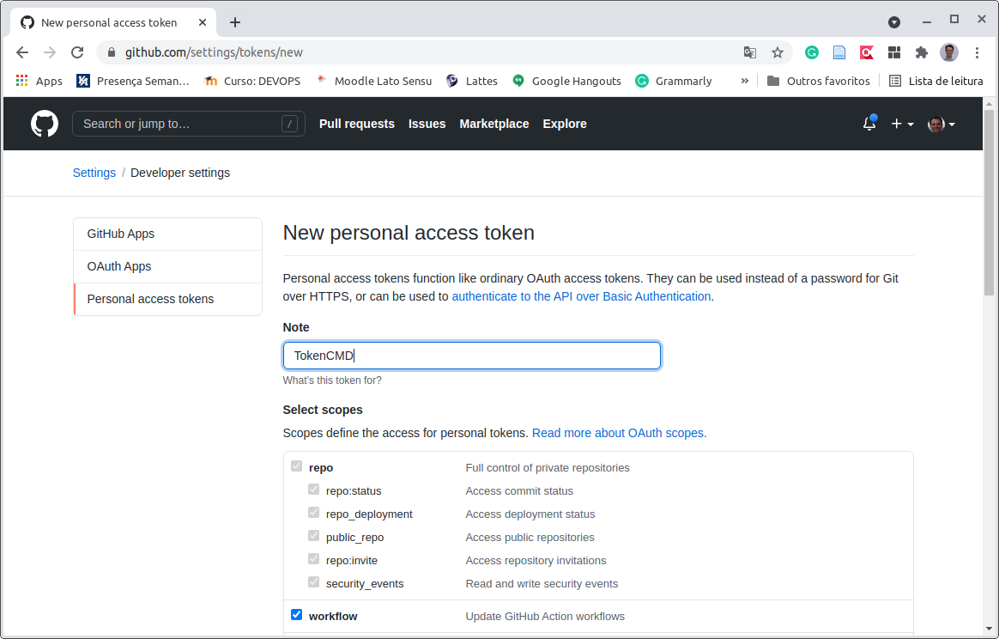

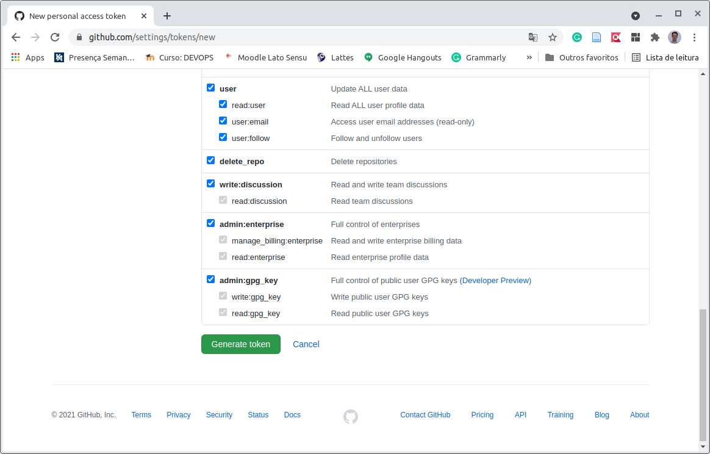

Feito isso, será apresentado o _token_ a você. Copie e cole em um arquivo texto pois você não será mais capaz de visualizá-lo assim que sair dessa tela. Se esquecer o número do _token_ terá que criar outro.

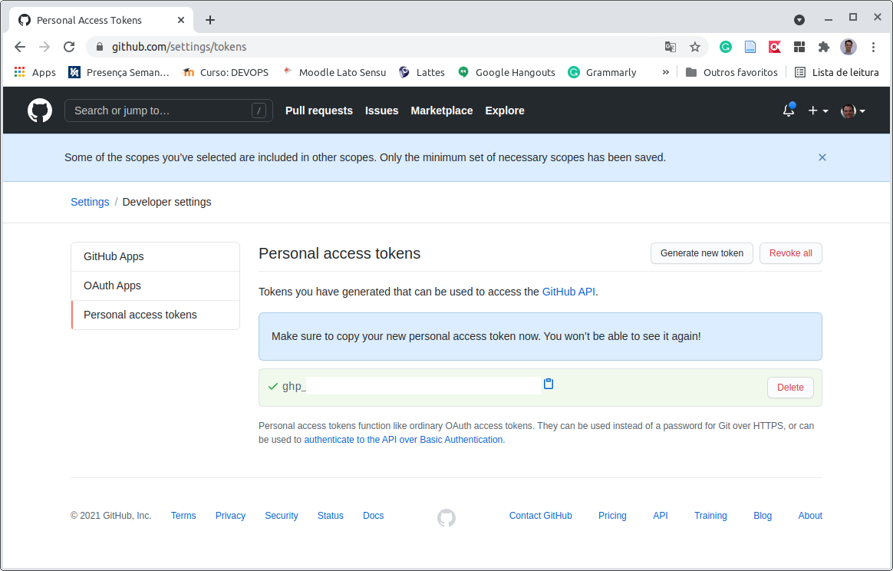

#### Criando Repositório Remoto

Para enviarmos o repositório local para o repositório remoto precisamos ainda criar um repositório vazio no GitHub. Para isso, basta clicar sobre sua foto e escolher a opção _Your repositories_. Em seguida, clicar no botão _New_, dar um nome para o repositório \(`superlists` no exemplo\), escolher a visibilidade desejada \(`public` no exemplo\) e clicar em _Create repository_.

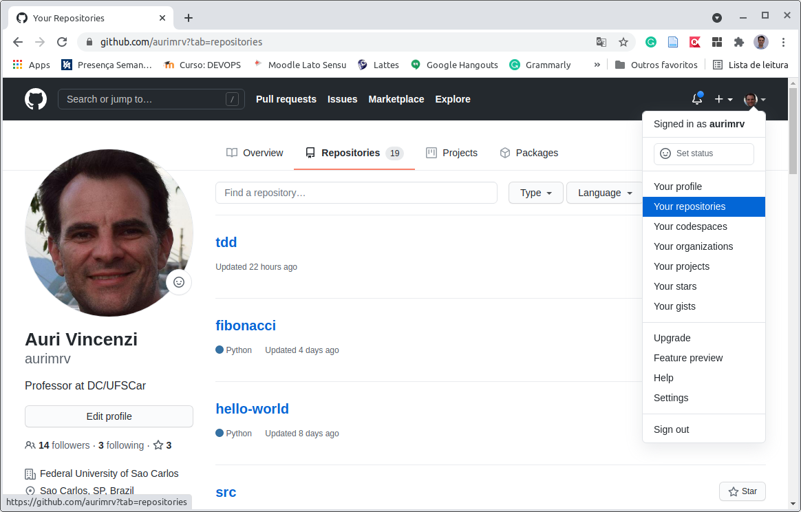

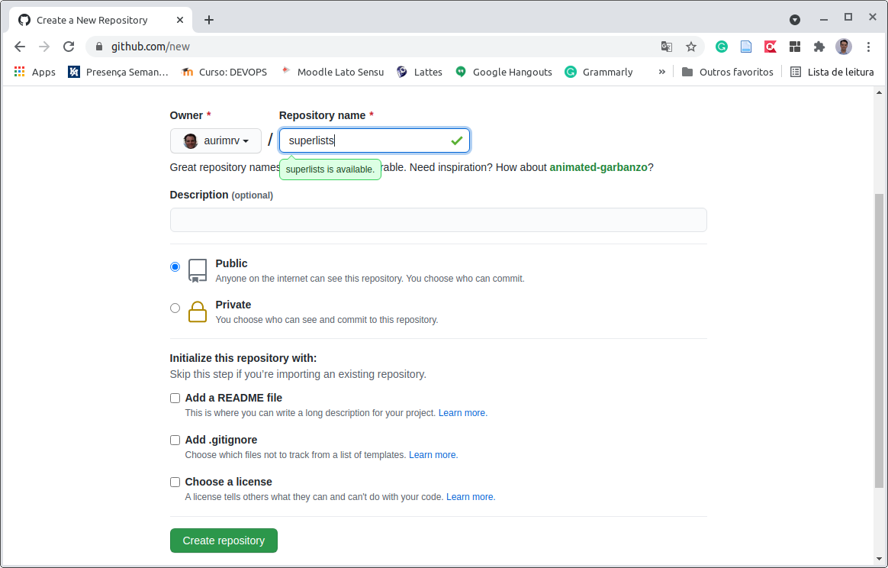

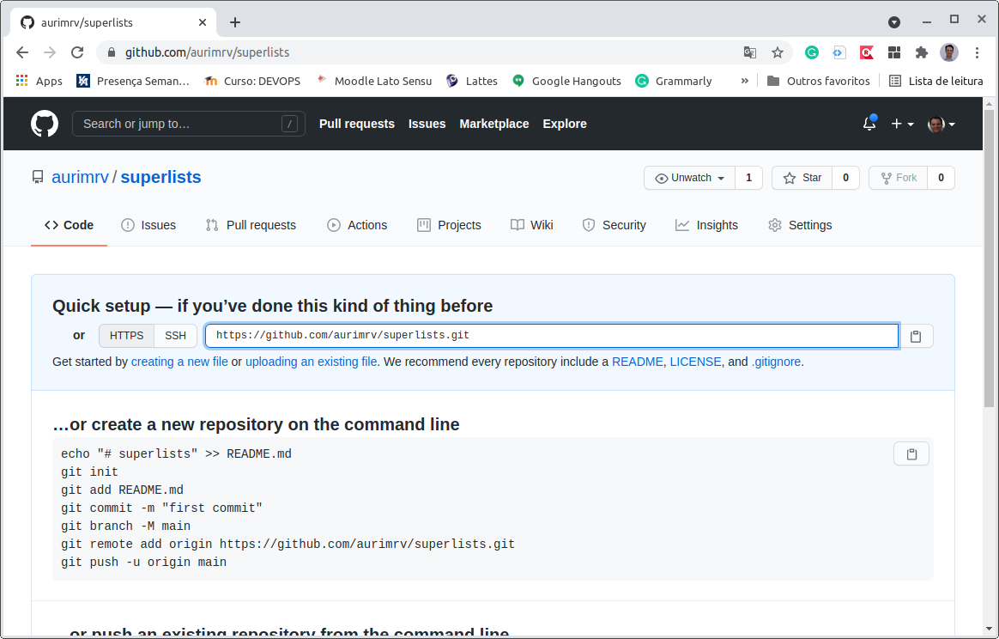

Criado o repositório é importante anotar também a URL de acesso do mesmo, que aparece em destaque na imagem acima. No exemplo essa URL é a [https://github.com/aurimrv/superlists.git](https://github.com/aurimrv/superlists.git). 

**Enviando Arquivos do Repositório Local para o Remoto**

Feito isso estamos prontos para enviar os arquivos do diretório local para o repositório remoto. Para isso, usaremos o comando `git push`, conforme ilustrado abaixo. Durante a execução desse comando precisamos da URL do repositório no GitHub, do nome do usuário no GitHub e do _token_ de acesso que foi gerado.

O primeiro passo \(linha 1\) é adicionar os dados do repositório remoto à origem do nosso repositório. Em seguida, para enviar os dados do repositório local para o remoto utilizamos o comando da linha 2, `git push`.

Ao executar esse comando, o Git irá solicitar nosso login \(`aurimrv` no exemplo\) e a senha que deve ser o _token_ criado anteriormente. 

```text
(superlists) auri@av:~/tdd/superlists/superlists$ git remote add origin https://github.com/aurimrv/superlists.git
(superlists) auri@av:~/tdd/superlists/superlists$ git push -u origin master
Username for 'https://github.com': aurimrv
Password for 'https://aurimrv@github.com': 
Enumerating objects: 11, done.
Counting objects: 100% (11/11), done.
Delta compression using up to 12 threads
Compressing objects: 100% (9/9), done.
Writing objects: 100% (11/11), 2.96 KiB | 2.96 MiB/s, done.
Total 11 (delta 1), reused 0 (delta 0)
remote: Resolving deltas: 100% (1/1), done.
To https://github.com/aurimrv/superlists.git
 * [new branch]      master -> master
Branch 'master' set up to track remote branch 'master' from 'origin'.

```

A figura a seguir ilustra o repositório atualizado no GitHub com os arquivos que estavam apenas no nosso repositório local.

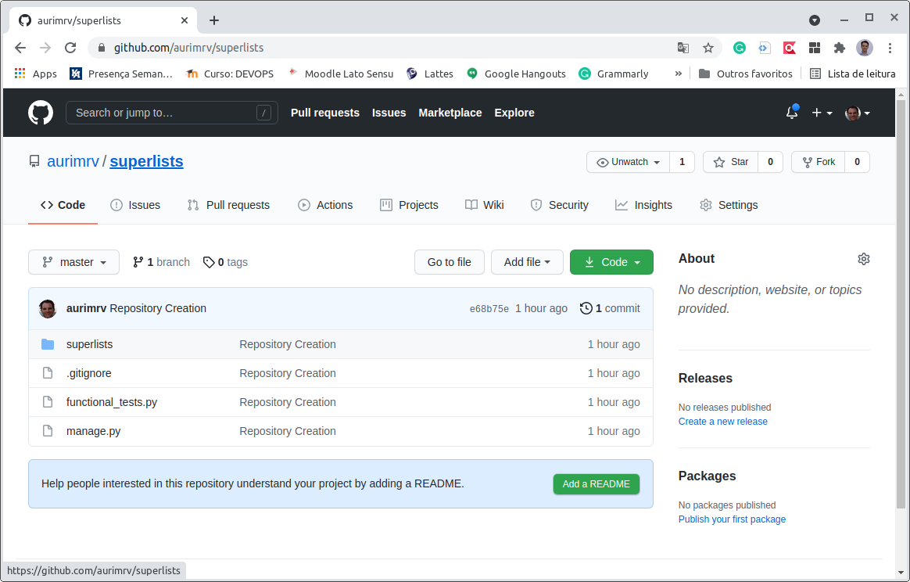

#### Alterando o Repositório Remoto

Como podemos observar na tela acima, no GitHub aparece uma mensagem de que não criamos o arquivo README.md, que explica o conteúdo do repositório. Para adicionar tal arquivo ao projeto, basta clicarmos no botão _Add a README_ que podemos editá-lo dentro do próprio GitHub, conforme ilustrado a seguir.

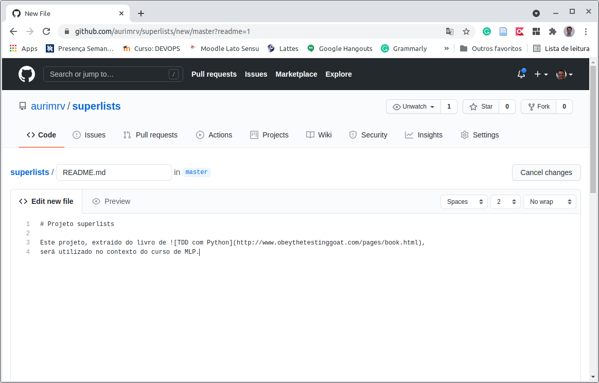

Finalizada a edição, basta realizarmos a confirmação das mudanças \(_Commit new file_\) para que o arquivo seja salvo em nosso projeto.

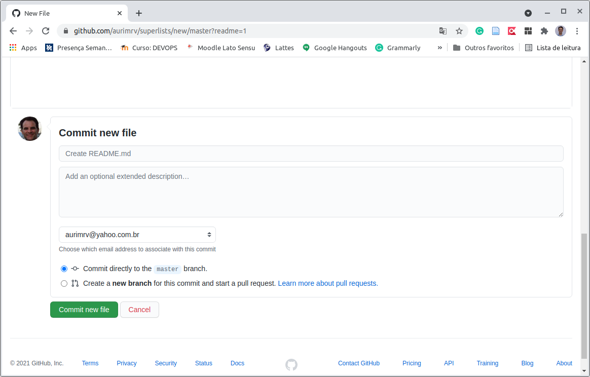

A tela a seguir agora exibe a descrição do projeto na tela inicial do repositório.

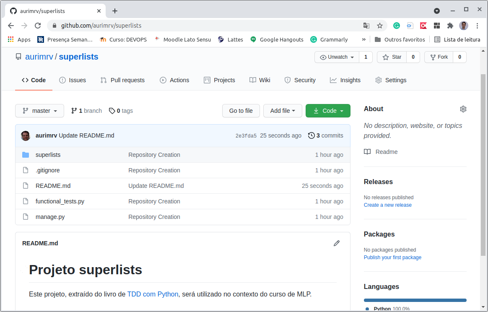

#### Atualizando o Repositório Local com os Dados do Repositório Remoto

Uma vez que criamos o arquivo `README.md` remotamente, ele não está presente no nosso diretório local. Para atualizar nossa cópia local podemos utilizar os comandos das linhas 1, 4 e 12 abaixo e manter tudo sincronizado.

```text
(superlists) auri@av:~/tdd/superlists/superlists$ git checkout master
Already on 'master'
Your branch is up to date with 'origin/master'.
(superlists) auri@av:~/tdd/superlists/superlists$ git fetch origin
remote: Enumerating objects: 7, done.
remote: Counting objects: 100% (7/7), done.
remote: Compressing objects: 100% (6/6), done.
remote: Total 6 (delta 3), reused 0 (delta 0), pack-reused 0
Unpacking objects: 100% (6/6), 1.40 KiB | 1.40 MiB/s, done.
From https://github.com/aurimrv/superlists
   e68b75e..2e3fda5  master     -> origin/master
(superlists) auri@av:~/tdd/superlists/superlists$ git rebase origin/master
First, rewinding head to replay your work on top of it...
Fast-forwarded master to origin/master.
(superlists) auri@av:~/tdd/superlists/superlists$ 
```

A execução do `git status` conforma que os repositórios estão sincronizados e o arquivo README.md já está presente no repositório local.

```text
(superlists) auri@av:~/tdd/superlists/superlists$ git status
No ramo master
Your branch is up to date with 'origin/master'.

nothing to commit, working tree clean
(superlists) auri@av:~/tdd/superlists/superlists$ ls -l
total 144
-rw-r--r-- 1 auri auri 131072 abr 26 20:39 db.sqlite3
-rw-rw-r-- 1 auri auri    144 abr 26 20:45 functional_tests.py
-rwxrwxr-x 1 auri auri    666 abr 26 20:31 manage.py
-rw-rw-r-- 1 auri auri    173 abr 27 19:53 README.md
drwxrwxr-x 3 auri auri   4096 abr 26 20:37 superlists
(superlists) auri@av:~/tdd/superlists/superlists$ 
```

Para evitar conflitos em repositórios é importante manter a sincronização. Desse modo, uma das práticas recomendadas no desenvolvimento é a realização de _commits_ frequentes.

