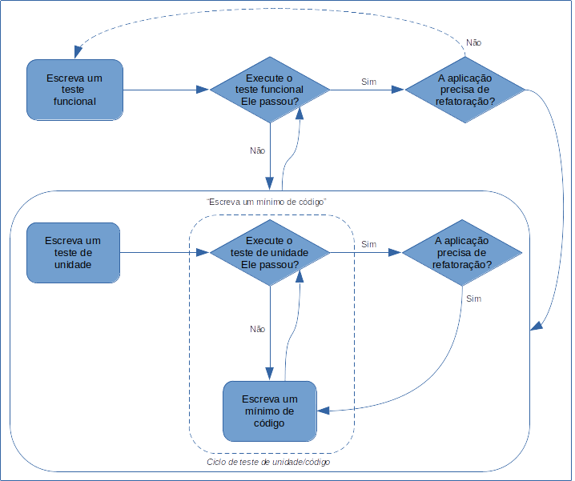

# 3.7 Revisando o Processo do TDD

Para encerrar esse capítulo é importante lembrarmos o ciclo do TDD que seguimos até aqui. [Percival \(2017\)](http://www.obeythetestinggoat.com/pages/book.html) propõe um ciclo ligeiramente diferente do apresentado na [Seção 1.3](../1-introducao/1-3-tdd-basico/). Naquele ciclo, não fizemos distinção sobre o tipo de teste que estávamos executando. 

[Percival \(2017\)](http://www.obeythetestinggoat.com/pages/book.html) combina dois tipos de testes na composição do ciclo do TDD: testes funcionais e testes de unidade. Os funcionais, mais de alto nível, buscam gerar testes próximos do usuário, executando o sistema como o usuário o vê externamente. O teste unitário é usado para testar a aplicação do ponto de vista do desenvolvedor.

Desse modo, ao combinar esses dois tipos de testes, [Percival \(2017\)](http://www.obeythetestinggoat.com/pages/book.html) usa o teste funcional para descrever uma nova funcionalidade do ponto de vista do usuário e documenta nele, uma história do usuário. Assim que esse teste falhe dá-se início ao processo para fazê-lo passar e, nesse ponto é que entram os testes unitários, detalhando os passos do teste funcional do ponto de vista de programação, dando mais segurança de que o código funciona corretamente e atende às necessidades do usuário.

A figura abaixo, adaptada de [Percival \(2017\)](http://www.obeythetestinggoat.com/pages/book.html), ilustra esse ciclo.

