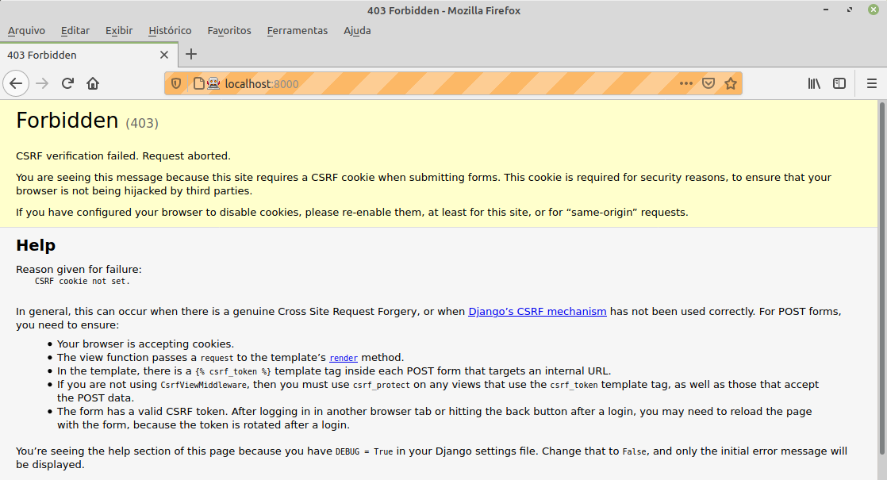

# 4.1 Envio e Processamento de Requisição POST

No capítulo anterior, interrompemos a implementação da nossa aplicação pela necessidade de processarmos os itens a serem armazenados em nossa lista. O primeiro passo para isso é permitir que nossa página envie uma requisição `POST` para ser processada. 

Para fazer isso precisamos realizar duas operações no nosso _template_: 1\) inserir um atributo `name` no elemento `input`\(`name="item_text"`\); e 2\) encapsular o elemento `input` em uma tag `form` com método `POST`. O resultado é mostrado abaixo:

```text
<html>
	<head>
		<title>To-Do lists</title>
	</head>
	<body>
		<h1>Your To-Do list</h1>
		<form method="POST">
			<input name="item_text" id="id_new_item" placeholder="Enter a to-do item" />
		</form>
		<table id="id_list_table">
		</table>
	</body>
</html>
```

Com essa alteração, ao executar o teste funcional temos o resultado abaixo:

```text
(superlists) auri@av:~/tdd/superlists/superlists$ python functional_tests.py 
E
======================================================================
ERROR: test_can_start_a_list_and_retrieve_it_later (__main__.NewVsitorTest)
----------------------------------------------------------------------
...
selenium.common.exceptions.NoSuchElementException: Message: Unable to locate element: [id="id_list_table"]


----------------------------------------------------------------------
Ran 1 test in 4.124s

FAILED (errors=1)
```

Pela mensagem, o Selenium não foi capaz de localizar na página o elemento com `id="id_list_table"`. Quando um elemento não é encontrado, a primeira coisa que imaginamos é que ainda não deu tempo do elemento ser renderizado e, desse modo, podemos tentar aumentar o tempo do comando `time.sleep` e verificar o que acontece. No caso, substituímos o antigo `time.sleep(1)` por `time.sleep(10)`. Agora, ao executarmos os testes, a espera será bem maior e será possível verificarmos se o Selenium é capaz de achar o elemento procurado. Entretanto, o que vemos é que o problema persiste mas, com o tempo maior conseguimos ler a tela e a mensagem de erro que ela apresenta, exibida abaixo.



Basicamente, o Django está nos alertando que, quando utilizamos métodos POST em formulário, é necessária a utilização de um _token_ para proteger nossa aplicação contra o ataque de [_Cross Site Request Forgery \(CSRF\)_](https://www.squarefree.com/securitytips/web-developers.html#CSRF). Para mais informações o leitor interessado pode consultar a documentação do Django em [https://docs.djangoproject.com/en/3.2/ref/csrf/](https://docs.djangoproject.com/en/3.2/ref/csrf/). O procedimento básico para resolver o problema no nosso exemplo é incluir a tag ``dentro de todo elemento `<form>` que for para uma URL interna. No Django, tags envolvidas por `` são chamadas de tags de _template_.

Assim sendo, a correção do nosso template é apresentada abaixo.

```text
<html>
	<head>
		<title>To-Do lists</title>
	</head>
	<body>
		<h1>Your To-Do list</h1>
		<form method="POST">
			<input name="item_text" id="id_new_item" placeholder="Enter a to-do item" />
			
		</form>
		<table id="id_list_table">
		</table>
	</body>
</html>
```

Agora, ao executarmos os testes, apesar de demorar um tempo, o resultado de falha é o mesmo que estávamos obtendo anteriormente e podemos retornar o comando `time.sleep(10)` para `time.sleep(1)` em nosso caso de teste funcional, já que o problema não era de sincronização.

```text
(superlists) auri@av:~/tdd/superlists/superlists$ python functional_tests.py 
F
======================================================================
FAIL: test_can_start_a_list_and_retrieve_it_later (__main__.NewVsitorTest)
----------------------------------------------------------------------
Traceback (most recent call last):
  File "functional_tests.py", line 51, in test_can_start_a_list_and_retrieve_it_later
    self.assertTrue(
AssertionError: False is not true : New to-do item not appear in table

----------------------------------------------------------------------
Ran 1 test in 12.187s

FAILED (failures=1)
```

#### Processando uma Requisição POST no Servidor

Como podemos observar no nosso `form` de submissão de dados via método `POST`, o mesmo não contém um atributo `action` e, dessa forma, a  submissão dos dados é feita para a mesma URL, ou seja, para a raiz de nosso site \(`'/'`\), sendo nossa função `home_page` responsável por atender essa requisição. Desse modo, para darmos andamento na evolução da aplicação precisamos de um novo teste unitário para nos guiar nessa missão. Para isso, acrescentaremos um novo método de teste \(`test_can_save_a_POST_request`- linhas 15 a 17\) no nosso arquivo `lists/tests.py`, conforme ilustrado abaixo:

```text
from django.urls import resolve
from django.test import TestCase
from lists.views import home_page

class HomePageTest(TestCase):

	def test_root_url_resolves_to_home_page_view(self):
		found = resolve('/')
		self.assertEquals(found.func, home_page)

	def test_home_page_returns_correct_html(self):
		response = self.client.get('/')
		self.assertTemplateUsed(response, 'wrong.html')

	def test_can_save_a_POST_request(self):
		response = self.client.post('/', data={'item_text': 'A new list item'})
		self.assertIn('A new list item', response.content.decode())
```

Utilizamos o método `self.client.post` no caso de teste para enviar uma requisição `POST` e passamos no argumento data as informações que desejamos que seja enviada.

Ao executar o teste obtemos o resultado abaixo, indicando que o item 'A new list item' não foi encontrado \(linha 11\).

```text
(superlists) auri@av:~/tdd/superlists/superlists$ python manage.py test
Creating test database for alias 'default'...
System check identified no issues (0 silenced).
F..
======================================================================
FAIL: test_can_save_a_POST_request (lists.tests.HomePageTest)
----------------------------------------------------------------------
Traceback (most recent call last):
  File "/home/auri/insync/tdd/superlists/superlists/lists/tests.py", line 17, in test_can_save_a_POST_request
    self.assertIn('A new list item', response.content.decode())
AssertionError: 'A new list item' not found in '<html>\n\t<head>\n\t\t<title>To-Do lists</title>\n\t</head>\n\t<body>\n\t\t<h1>Your To-Do list</h1>\n\t\t<form method="POST">\n\t\t\t<input name="item_text" id="id_new_item" placeholder="Enter a to-do item" />\n\t\t\t<input type="hidden" name="csrfmiddlewaretoken" value="UBgUJXF1gVKkGcTHiOczODe7KPs0X76ZEQXgQ9cpVPe1y4TCpOR6hFvu5Rq0ZFkV">\n\t\t</form>\n\t\t<table id="id_list_table">\n\t\t</table>\n\t</body>\n</html>'

----------------------------------------------------------------------
Ran 3 tests in 0.006s

FAILED (failures=1)
Destroying test database for alias 'default'...

```

A correção da aplicação para fazer o teste passar pode ser a inclusão de um simples `if` no arquivo `lists/view.py` com um tratamento mínimo, conforme abaixo. Obviamente essa ainda não é a solução que desejamos, com certeza, mas lembre-se que estamos seguindo a risca o que prega o TDD.

```text
from django.http import HttpResponse
from django.shortcuts import render

# Create your views here.
def home_page(request):
	if (request.method == 'POST'):
		return HttpResponse(request.POST['item_text'])
	return render(request, 'home.html')
```

Ao reexecutar os testes temos o resultado abaixo:

```text
(superlists) auri@av:~/tdd/superlists/superlists$ python manage.py test
Creating test database for alias 'default'...
System check identified no issues (0 silenced).
...
----------------------------------------------------------------------
Ran 3 tests in 0.006s

OK
Destroying test database for alias 'default'...
```

#### Passando Variáveis do Python para o Template

A forma de integrarmos variáveis do Python dentro de _templates_ Django é por meio da notação {{...}}. O objeto presente dentro desses pares de chaves serão convertidos para uma _string_ dentro de nosso _template_. Desse modo, podemos iniciar as modificações no código de nosso _template_ para aceitar variáveis Python. O exemplo a seguir ilustra o uso da variável `{{ new_item_text }}` dentro de nosso _template_ \(linha 12\).

```text
<html>
	<head>
		<title>To-Do lists</title>
	</head>
	<body>
		<h1>Your To-Do list</h1>
		<form method="POST">
			<input name="item_text" id="id_new_item" placeholder="Enter a to-do item" />
			
		</form>
		<table id="id_list_table">
			<tr><td>{{ new_item_text }}</td></tr>
		</table>
	</body>
</html>
```

Vamos alterar o nosso teste para verificar o uso do nosso template alterado.

```text
from django.urls import resolve
from django.test import TestCase
from lists.views import home_page

class HomePageTest(TestCase):

	def test_root_url_resolves_to_home_page_view(self):
		found = resolve('/')
		self.assertEquals(found.func, home_page)

	def test_home_page_returns_correct_html(self):
		response = self.client.get('/')
		self.assertTemplateUsed(response, 'home.html')

	def test_can_save_a_POST_request(self):
		response = self.client.post('/', data={'item_text': 'A new list item'})
		self.assertIn('A new list item', response.content.decode())
		self.assertTemplateUsed(response, 'home.html')
```

Ao executar o teste temos o resultado abaixo, ou seja, uma falha pois nosso código com aquela implementação simples não está mais conseguindo enganar nosso teste e, desse modo, podemos melhorar nossa _view_.

```text
(superlists) auri@av:~/tdd/superlists/superlists$ python manage.py test
Creating test database for alias 'default'...
System check identified no issues (0 silenced).
F..
======================================================================
FAIL: test_can_save_a_POST_request (lists.tests.HomePageTest)
----------------------------------------------------------------------
Traceback (most recent call last):
  File "/home/auri/insync/tdd/superlists/superlists/lists/tests.py", line 18, in test_can_save_a_POST_request
    self.assertTemplateUsed(response, 'home.html')
  File "/home/auri/insync/tdd/superlists/lib/python3.8/site-packages/django/test/testcases.py", line 656, in assertTemplateUsed
    self.fail(msg_prefix + "No templates used to render the response")
AssertionError: No templates used to render the response

----------------------------------------------------------------------
Ran 3 tests in 0.007s

FAILED (failures=1)
Destroying test database for alias 'default'...
```

A correção envolve usarmos o _template_ e passarmos os dados que desejamos para ele, conforme ilustrado abaixo na alteração do arquivo `lists/view.py`.  A função render que estamos usando aceita um terceiro parâmetro que consiste de um dicionário de dados que faz o mapeamento de nomes de variáveis do template para os seus respectivos valores.

```text
from django.shortcuts import render

# Create your views here.
def home_page(request):
	return render(request, 'home.html', {'new_item_text': request.POST['item_text']} )
```

Após a alteração, ao reexecutar o teste, passamos a ter a chamada falha esperada mas de um modo diferente do que havíamos presenciado até o momento. O teste que estávamos trabalhando passou e o que falhou foi o teste anterior que estava funcionando.

A correção do código para fazer o teste passar é usarmos a função `dict.get` do Python para obter os valores a serem passados. O código abaixo mostra a correção. Para saber mais sobre o `dict.get` podemos consultar a documentação oficial em [https://docs.python.org/3/library/stdtypes.html\#dict](https://docs.python.org/3/library/stdtypes.html#dict). Basicamente, o método `get` retorna o valor da chave se a chave for encontrada no dicionário, do contrário, ela retorna o valor padrão que, no nosso exemplo, é o string vazio \(`''`\).

```text
from django.shortcuts import render

# Create your views here.
def home_page(request):
	return render(request, 'home.html', {
		'new_item_text': request.POST.get('item_text', '')
	})
```

Ao executar os testes unitário novamente após a alteração os mesmos passam com sucesso, conforme mensagem abaixo:

```text
(superlists) auri@av:~/tdd/superlists/superlists$ python manage.py test
Creating test database for alias 'default'...
System check identified no issues (0 silenced).
...
----------------------------------------------------------------------
Ran 3 tests in 0.007s

OK
Destroying test database for alias 'default'...
```

Entretanto, ao reexecutar os testes funcionais obtemos uma falha:

```text
(superlists) auri@av:~/tdd/superlists/superlists$ python functional_tests.py 
F
======================================================================
FAIL: test_can_start_a_list_and_retrieve_it_later (__main__.NewVsitorTest)
----------------------------------------------------------------------
Traceback (most recent call last):
  File "functional_tests.py", line 51, in test_can_start_a_list_and_retrieve_it_later
    self.assertTrue(
AssertionError: False is not true : New to-do item not appear in table

----------------------------------------------------------------------
Ran 1 test in 3.088s

FAILED (failures=1)
```

Existe uma forma de melhorarmos um pouco mais essa mensagem de erro exibida. O Python oferece na versão 3.6 em diante o recurso chamado de f-string que permite presceder uma string com a letra f e então fazer uso das chaves para inserir variáveis locais na string. Observe como ficou o código dos testes funcionais com o uso do recurso de f-string.

```text
...
		self.assertTrue(
			any(row.text == '1: Buy peacock featers' for row in rows),
			f"New to-do item not appear in table. Content were:\n{table.text}"
		)
...
```

Após a alteração e reexecução dos testes funcionais, a mensagem de falha aparece como abaixo:

```text
(superlists) auri@av:~/tdd/superlists/superlists$ python functional_tests.py 
F
======================================================================
FAIL: test_can_start_a_list_and_retrieve_it_later (__main__.NewVsitorTest)
----------------------------------------------------------------------
Traceback (most recent call last):
  File "functional_tests.py", line 51, in test_can_start_a_list_and_retrieve_it_later
    self.assertTrue(
AssertionError: False is not true : New to-do item not appear in table. Content were:
Buy peacock featers

----------------------------------------------------------------------
Ran 1 test in 3.245s

FAILED (failures=1)
```

Entretanto, conseguimos melhorar ainda mais nosso caso de teste e substituir o `assertTrue` por um `assertIn` e, gratuitamente, ganharmos a mensagens de erro sem fazer uso do f-string.

```text
...
self.assertIn('1: Buy peacock featers', [row.text for row in rows])
...
```

Após a troca do `assert`, o resultado da execução fica assim:

```text
(superlists) auri@av:~/tdd/superlists/superlists$ python functional_tests.py 
F
======================================================================
FAIL: test_can_start_a_list_and_retrieve_it_later (__main__.NewVsitorTest)
----------------------------------------------------------------------
Traceback (most recent call last):
  File "functional_tests.py", line 51, in test_can_start_a_list_and_retrieve_it_later
    self.assertIn('1: Buy peacock featers', [row.text for row in rows])
AssertionError: '1: Buy peacock featers' not found in ['Buy peacock featers']

----------------------------------------------------------------------
Ran 1 test in 3.109s

FAILED (failures=1)
```

Como podemos observar a diferença entre o resultado obtido e o esperado é que o teste funcional deseja que o resultado seja enumerado e o retorno ainda não está enumerando os itens retornados. Para conseguirmos ter o teste aprovado podemos fazer essa simples alteração no template \(linha 12\).

```text
<html>
	<head>
		<title>To-Do lists</title>
	</head>
	<body>
		<h1>Your To-Do list</h1>
		<form method="POST">
			<input name="item_text" id="id_new_item" placeholder="Enter a to-do item" />
			
		</form>
		<table id="id_list_table">
			<tr><td>1: {{ new_item_text }}</td></tr>
		</table>
	</body>
</html>
```

E agora ao reexecutar os testes funcionais conseguimos avançar e parar o self.fail que incluimos propositalmente em nosso teste.

```text
(superlists) auri@av:~/tdd/superlists/superlists$ python functional_tests.py 
F
======================================================================
FAIL: test_can_start_a_list_and_retrieve_it_later (__main__.NewVsitorTest)
----------------------------------------------------------------------
Traceback (most recent call last):
  File "functional_tests.py", line 58, in test_can_start_a_list_and_retrieve_it_later
    self.fail('Finish the test!')
AssertionError: Finish the test!

----------------------------------------------------------------------
Ran 1 test in 3.174s

FAILED (failures=1)
```

Podemos então estender mais um pouco o nosso teste funcional e o fizemos complementando as descrições da história entre as linhas 42 a 74. Veja código completo abaixo:

```text
from selenium import webdriver
from selenium.webdriver.common.keys import Keys
import time
import unittest

class NewVsitorTest(unittest.TestCase):

	def setUp(self):
		self.browser = webdriver.Firefox()

	def tearDown(self):
		self.browser.quit()

	def test_can_start_a_list_and_retrieve_it_later(self):
		# Edith ouviu falar de uma nova aplicação online interessante
		# para lista de tarefas. Ela decide verificar a homepage

		self.browser.get("http://localhost:8000")

		# Ela percebe que o título da página e o cabeçalho mencionam
		# listas de tarefas (to-do)

		self.assertIn('To-Do', self.browser.title)
		header_text = self.browser.find_element_by_tag_name('h1').text
		self.assertIn('To-Do', header_text)
		
		# Ela é convidada a inserir um item de tarefa imediatamente

		inputbox = self.browser.find_element_by_id('id_new_item')
		self.assertEqual(
			inputbox.get_attribute('placeholder'),
			'Enter a to-do item'
		)

		# Ela digita "Buy peacock featers" (Comprar penas de pavão)
		# em uma nova caixa de texto (o hobby de Edith é fazer iscas
		# para pesca com fly)

		inputbox.send_keys('Buy peacock featers')


		# Quando ela tecla enter, a página é atualizada, e agora
		# a página lista "1 - Buy peacock feathers" como um item em 
		# uma lista de tarefas

		inputbox.send_keys(Keys.ENTER)
		time.sleep(1)

		table = self.browser.find_element_by_id('id_list_table')
		rows = table.find_elements_by_tag_name('tr')
		self.assertIn('1: Buy peacock featers', [row.text for row in rows])

		# Ainda continua havendo uma caixa de texto convidando-a a 
		# acrescentar outro item. Ela insere "Use peacock feathers 
		# to make a fly" (Usar penas de pavão para fazer um fly - 
		# Edith é bem metódica)
		inputbox = self.browser.find_element_by_id('id_new_item')
		inputbox.send_keys("Use peacock feathers to make a fly")
		inputbox.send_keys(Keys.ENTER)
		time.sleep(1)

		# A página é atualizada novamente e agora mostra os dois
		# itens em sua lista
		table = self.browser.find_element_by_id('id_list_table')
		rows = table.find_elements_by_tag_name('tr')
		self.assertIn('1: Buy peacock featers', [row.text for row in rows])
		self.assertIn('2: Use peacock feathers to make a fly', 
			[row.text for row in rows])

		# Edith se pergunta se o site lembrará de sua lista. Então
		# ela nota que o site gerou um URL único para ela -- há um 
		# pequeno texto explicativo para isso.

		self.fail('Finish the test!')

		# Ela acessa essa URL -- sua lista de tarefas continua lá.

		# Satisfeita, ela volta a dormir

if __name__ == '__main__':
	unittest.main()
```

O problema é que com essa complementação, nossos testes voltam a falhar uma vez que o código da aplicação não evolve toda a lista de itens enumerada. Na verdade, sequer essa lista é salva para ser recuperada posteriormente.

```text
(superlists) auri@av:~/tdd/superlists/superlists$ python functional_tests.py 
F
======================================================================
FAIL: test_can_start_a_list_and_retrieve_it_later (__main__.NewVsitorTest)
----------------------------------------------------------------------
Traceback (most recent call last):
  File "functional_tests.py", line 66, in test_can_start_a_list_and_retrieve_it_later
    self.assertIn('1: Buy peacock featers', [row.text for row in rows])
AssertionError: '1: Buy peacock featers' not found in ['1: Use peacock feathers to make a fly']

----------------------------------------------------------------------
Ran 1 test in 4.368s

FAILED (failures=1)
```

Antes de continuarmos e alterarmos o código da aplicação, podemos melhorar um pouco mais nosso código funcional removendo a redundância presente nele. Primeiro vamos confirmar essas alterações realizadas até aqui e, em seguida, melhoraremos o nosso caso de teste.,

```text
(superlists) auri@av:~/tdd/superlists/superlists$ git commit -am "Estending user story to deal with a second list item"
[master 24e8605] Estending user story to deal with a second list item
 2 files changed, 14 insertions(+), 8 deletions(-)
(superlists) auri@av:~/tdd/superlists/superlists$ git push
Username for 'https://github.com': aurimrv
Password for 'https://aurimrv@github.com': 
Enumerating objects: 11, done.
Counting objects: 100% (11/11), done.
Delta compression using up to 12 threads
Compressing objects: 100% (5/5), done.
Writing objects: 100% (6/6), 693 bytes | 693.00 KiB/s, done.
Total 6 (delta 4), reused 0 (delta 0)
remote: Resolving deltas: 100% (4/4), completed with 4 local objects.
To https://github.com/aurimrv/superlists.git
   d0698d2..24e8605  master -> master
```

Se observarmos, estamos fazendo uma verificação dos itens da lista mais de uma vez e isso gera redundância no código de testes. Podemos melhorá-lo conforme abaixo. 

```text
from selenium import webdriver
from selenium.webdriver.common.keys import Keys
import time
import unittest

class NewVsitorTest(unittest.TestCase):

	def setUp(self):
		self.browser = webdriver.Firefox()

	def tearDown(self):
		self.browser.quit()

	# Auxiliary method 
	def check_for_row_in_list_table(self, row_text):
		table = self.browser.find_element_by_id('id_list_table')
		rows = table.find_elements_by_tag_name('tr')
		self.assertIn(row_text, [row.text for row in rows])

	def test_can_start_a_list_and_retrieve_it_later(self):
		# Edith ouviu falar de uma nova aplicação online interessante
		# para lista de tarefas. Ela decide verificar a homepage

		self.browser.get("http://localhost:8000")

		# Ela percebe que o título da página e o cabeçalho mencionam
		# listas de tarefas (to-do)

		self.assertIn('To-Do', self.browser.title)
		header_text = self.browser.find_element_by_tag_name('h1').text
		self.assertIn('To-Do', header_text)
		
		# Ela é convidada a inserir um item de tarefa imediatamente

		inputbox = self.browser.find_element_by_id('id_new_item')
		self.assertEqual(
			inputbox.get_attribute('placeholder'),
			'Enter a to-do item'
		)

		# Ela digita "Buy peacock featers" (Comprar penas de pavão)
		# em uma nova caixa de texto (o hobby de Edith é fazer iscas
		# para pesca com fly)

		inputbox.send_keys('Buy peacock featers')

		# Quando ela tecla enter, a página é atualizada, e agora
		# a página lista "1 - Buy peacock feathers" como um item em 
		# uma lista de tarefas

		inputbox.send_keys(Keys.ENTER)
		time.sleep(1)
		self.check_for_row_in_list_table('1: Buy peacock featers')

		# Ainda continua havendo uma caixa de texto convidando-a a 
		# acrescentar outro item. Ela insere "Use peacock feathers 
		# to make a fly" (Usar penas de pavão para fazer um fly - 
		# Edith é bem metódica)
		inputbox = self.browser.find_element_by_id('id_new_item')
		inputbox.send_keys("Use peacock feathers to make a fly")
		inputbox.send_keys(Keys.ENTER)
		time.sleep(1)

		# A página é atualizada novamente e agora mostra os dois
		# itens em sua lista
		self.check_for_row_in_list_table('1: Buy peacock featers')
		self.check_for_row_in_list_table('2: Use peacock feathers to make a fly')

		# Edith se pergunta se o site lembrará de sua lista. Então
		# ela nota que o site gerou um URL único para ela -- há um 
		# pequeno texto explicativo para isso.

		self.fail('Finish the test!')

		# Ela acessa essa URL -- sua lista de tarefas continua lá.

		# Satisfeita, ela volta a dormir

if __name__ == '__main__':
	unittest.main()
```

Observe que criamos o método auxiliar `check_for_row_in_list_table` \(linhas 15 a 18\) e removemos a redundância fazendo a chamada a esse método nas linhas 53, 66 e 67. Refatorado nosso caso de teste, vamos confirmar novamente nossas mudanças colocando o código sob controle de versão.

```text
(superlists) auri@av:~/tdd/superlists/superlists$ git commit -am "Refactoring the functional testing to eliminate redundancy"
[master eef7e77] Refactoring the functional testing to eliminate redundancy
 1 file changed, 9 insertions(+), 10 deletions(-)
(superlists) auri@av:~/tdd/superlists/superlists$ git push
Username for 'https://github.com': aurimrv
Password for 'https://aurimrv@github.com': 
Enumerating objects: 5, done.
Counting objects: 100% (5/5), done.
Delta compression using up to 12 threads
Compressing objects: 100% (3/3), done.
Writing objects: 100% (3/3), 452 bytes | 452.00 KiB/s, done.
Total 3 (delta 2), reused 0 (delta 0)
remote: Resolving deltas: 100% (2/2), completed with 2 local objects.
To https://github.com/aurimrv/superlists.git
   24e8605..eef7e77  master -> master
```


