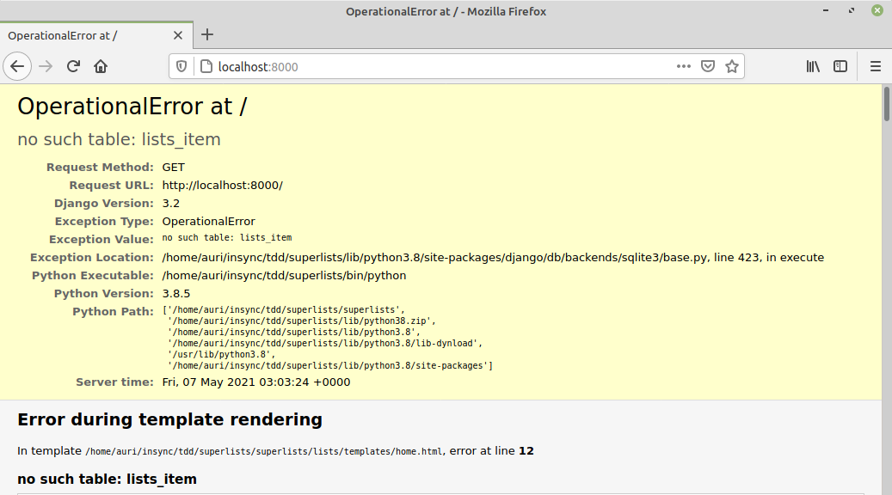

# 4.2 Banco de Dados no Django

Continuando nossa implementação, observamos que, para que os itens da lista fiquem disponível e possam ser consultados a posteriori faz-se necessário que os mesmos sejam armazenados em um meio de armazenamento persistente.

No caso do Django podemos contar com a disponibilidade de um mecanismo denominado _Object-Relational Mapper_ \(ORM\) ou Mapeador Objeto-Relacional, que transforma objetos de nossa aplicação em tabelas de um banco de dados relacional.

Como destaca [Percival \(2017\)](http://www.obeythetestinggoat.com/pages/book.html), nada melhor do que escrever um teste de unidade para conhecer melhor o mecanismo de ORM e como ele pode ser utilizado na melhoria de nossa aplicação. Desse modo, podemos criar uma nova classe de teste dentro de nosso arquivo `lists/tests.py`. O código da mesma segue abaixo. Observe que omitimos o restante do código que estava no arquivo tests.py para melhor visualização.

```text
...

from lists.models import Item

class ItemModelTest(TestCase):

	def test_saving_and_retriving_items(self):
		first_item = Item()
		first_item.text = 'The first (ever) list item'
		first_item.save()

		second_item = Item()
		second_item.text = 'Item the second'
		second_item.save()

		saved_items = Item.objects.all()
		self.assertEquals(saved_items.count(),2)

		first_saved_item = saved_items[0]
		second_saved_item = saved_items[1]

		self.assertEquals(first_saved_item.text, 'The first (ever) list item')
		self.assertEquals(second_saved_item.text, 'Item the second')
```

Aparentemente, o armazenamento de itens utilizando o ORM não é algo complicado. Os testes indicam que devemos ter um objeto do tipo `Item`, definirmos os valores de seus atributos \(no caso esperamos ter um atributo `text`\) e, em seguida, invocar o método `save()` nesse objeto. A mágica ocorre nesse momento em que o método `save()` é invocado e o objeto é então armazenado no banco de dados interno do Django.

Posteriormente, optamos pelo uso do método `Item.objects.all()` que recupera a lista de objetos já armazenada e fazemos os testes para termos certeza de que o que foi recuperado é o que havia sido salvo anteriormente.

Ao executar os testes unitários da forma como estão obtemos a saída abaixo como era de se esperar, ou seja, o teste está acusando que não foi capaz de encontrar a classe `Item`.

```text
(superlists) auri@av:~/tdd/superlists/superlists$ python manage.py test
System check identified no issues (0 silenced).
E
======================================================================
ERROR: lists.tests (unittest.loader._FailedTest)
----------------------------------------------------------------------
ImportError: Failed to import test module: lists.tests
Traceback (most recent call last):
  File "/usr/lib/python3.8/unittest/loader.py", line 436, in _find_test_path
    module = self._get_module_from_name(name)
  File "/usr/lib/python3.8/unittest/loader.py", line 377, in _get_module_from_name
    __import__(name)
  File "/home/auri/insync/tdd/superlists/superlists/lists/tests.py", line 21, in <module>
    from lists.models import Item
ImportError: cannot import name 'Item' from 'lists.models' (/home/auri/insync/tdd/superlists/superlists/lists/models.py)


----------------------------------------------------------------------
Ran 1 test in 0.000s

FAILED (errors=1)
```

Para iniciarmos as pequenas alterações com a intenção de fazer o teste acima avançar, precisamos editar o arquivo `lists/models.py` e criar dentro dele a classe Item conforme abaixo:

```text
from django.db import models

# Create your models here.
class Item(object):
	pass
```

Com essa alteração o resultado da execução dos testes acusa o próximo erro, indicando que nosso objeto não contém um método `save()`.

```text
(superlists) auri@av:~/tdd/superlists/superlists$ python manage.py test
Creating test database for alias 'default'...
System check identified no issues (0 silenced).
...E
======================================================================
ERROR: test_saving_and_retriving_items (lists.tests.ItemModelTest)
----------------------------------------------------------------------
Traceback (most recent call last):
  File "/home/auri/insync/tdd/superlists/superlists/lists/tests.py", line 28, in test_saving_and_retriving_items
    first_item.save()
AttributeError: 'Item' object has no attribute 'save'

----------------------------------------------------------------------
Ran 4 tests in 0.007s

FAILED (errors=1)
Destroying test database for alias 'default'...
```

A solução para isso é transformar nosso objeto `Item` em um verdadeiro _Model_ do Django, herdando da classe `models.Model`.

```text
from django.db import models

# Create your models here.
class Item(models.Model):
	pass
```

Com isso, o resultado dos nossos testes avançam e passam a emitir a próxima mensagem de erro dada abaixo:

```text
(superlists) auri@av:~/tdd/superlists/superlists$ python manage.py test
Creating test database for alias 'default'...
Traceback (most recent call last):
  File "/home/auri/insync/tdd/superlists/lib/python3.8/site-packages/django/db/backends/utils.py", line 84, in _execute
    return self.cursor.execute(sql, params)
  File "/home/auri/insync/tdd/superlists/lib/python3.8/site-packages/django/db/backends/sqlite3/base.py", line 423, in execute
    return Database.Cursor.execute(self, query, params)
sqlite3.OperationalError: no such table: lists_item

The above exception was the direct cause of the following exception:

Traceback (most recent call last):
  File "manage.py", line 22, in <module>
    main()
  File "manage.py", line 18, in main
    execute_from_command_line(sys.argv)
  File "/home/auri/insync/tdd/superlists/lib/python3.8/site-packages/django/core/management/__init__.py", line 419, in execute_from_command_line
    utility.execute()
  File "/home/auri/insync/tdd/superlists/lib/python3.8/site-packages/django/core/management/__init__.py", line 413, in execute
    self.fetch_command(subcommand).run_from_argv(self.argv)
  File "/home/auri/insync/tdd/superlists/lib/python3.8/site-packages/django/core/management/commands/test.py", line 23, in run_from_argv
    super().run_from_argv(argv)
  File "/home/auri/insync/tdd/superlists/lib/python3.8/site-packages/django/core/management/base.py", line 354, in run_from_argv
    self.execute(*args, **cmd_options)
  File "/home/auri/insync/tdd/superlists/lib/python3.8/site-packages/django/core/management/base.py", line 398, in execute
    output = self.handle(*args, **options)
  File "/home/auri/insync/tdd/superlists/lib/python3.8/site-packages/django/core/management/commands/test.py", line 55, in handle
    failures = test_runner.run_tests(test_labels)
  File "/home/auri/insync/tdd/superlists/lib/python3.8/site-packages/django/test/runner.py", line 725, in run_tests
    old_config = self.setup_databases(aliases=databases)
  File "/home/auri/insync/tdd/superlists/lib/python3.8/site-packages/django/test/runner.py", line 643, in setup_databases
    return _setup_databases(
  File "/home/auri/insync/tdd/superlists/lib/python3.8/site-packages/django/test/utils.py", line 179, in setup_databases
    connection.creation.create_test_db(
  File "/home/auri/insync/tdd/superlists/lib/python3.8/site-packages/django/db/backends/base/creation.py", line 90, in create_test_db
    self.connection._test_serialized_contents = self.serialize_db_to_string()
  File "/home/auri/insync/tdd/superlists/lib/python3.8/site-packages/django/db/backends/base/creation.py", line 136, in serialize_db_to_string
    serializers.serialize("json", get_objects(), indent=None, stream=out)
  File "/home/auri/insync/tdd/superlists/lib/python3.8/site-packages/django/core/serializers/__init__.py", line 129, in serialize
    s.serialize(queryset, **options)
  File "/home/auri/insync/tdd/superlists/lib/python3.8/site-packages/django/core/serializers/base.py", line 90, in serialize
    for count, obj in enumerate(queryset, start=1):
  File "/home/auri/insync/tdd/superlists/lib/python3.8/site-packages/django/db/backends/base/creation.py", line 133, in get_objects
    yield from queryset.iterator()
  File "/home/auri/insync/tdd/superlists/lib/python3.8/site-packages/django/db/models/query.py", line 353, in _iterator
    yield from self._iterable_class(self, chunked_fetch=use_chunked_fetch, chunk_size=chunk_size)
  File "/home/auri/insync/tdd/superlists/lib/python3.8/site-packages/django/db/models/query.py", line 51, in __iter__
    results = compiler.execute_sql(chunked_fetch=self.chunked_fetch, chunk_size=self.chunk_size)
  File "/home/auri/insync/tdd/superlists/lib/python3.8/site-packages/django/db/models/sql/compiler.py", line 1169, in execute_sql
    cursor.execute(sql, params)
  File "/home/auri/insync/tdd/superlists/lib/python3.8/site-packages/django/db/backends/utils.py", line 66, in execute
    return self._execute_with_wrappers(sql, params, many=False, executor=self._execute)
  File "/home/auri/insync/tdd/superlists/lib/python3.8/site-packages/django/db/backends/utils.py", line 75, in _execute_with_wrappers
    return executor(sql, params, many, context)
  File "/home/auri/insync/tdd/superlists/lib/python3.8/site-packages/django/db/backends/utils.py", line 84, in _execute
    return self.cursor.execute(sql, params)
  File "/home/auri/insync/tdd/superlists/lib/python3.8/site-packages/django/db/utils.py", line 90, in __exit__
    raise dj_exc_value.with_traceback(traceback) from exc_value
  File "/home/auri/insync/tdd/superlists/lib/python3.8/site-packages/django/db/backends/utils.py", line 84, in _execute
    return self.cursor.execute(sql, params)
  File "/home/auri/insync/tdd/superlists/lib/python3.8/site-packages/django/db/backends/sqlite3/base.py", line 423, in execute
    return Database.Cursor.execute(self, query, params)
django.db.utils.OperationalError: no such table: lists_item
```

A mensagem de erro é bem longa mas o mais importante é a informação apresentada na linha 63, ou seja, apesar de termos utilizado o ORM para modelar como um objeto será armazenado no banco de dados relacional, para que tudo funcione é necessário utilizar um segundo sistema que irá criar esse banco de dados. Na terminologia do Django, o sistema responsável por isso se chama de migrações ou _migrations_.

#### Primeira Migração de Banco de Dados

O sistema de migrações pode se pensado como um sistema de controle de versões para banco de dados. Ocorrendo qualquer alteração nas classes que devem ter seus objetos armazenados, é necessário realizar uma nova migração.

Por hora, basta sabermos como realizar a operação de migração, e ela é feita com o comando abaixo:

```text
$ python manage.py makemigrations
Migrations for 'lists':
  lists/migrations/0001_initial.py
    - Create model Item
    
(superlists) auri@av:~/tdd/superlists/superlists$ ls lists/migrations/
0001_initial.py  __init__.py  __pycache__
```

Feito isso, ao tentar reexecutar os testes observamos que a execução dos mesmos vai até encontrar o atributo `.text` que ainda não está declarado em nossa classe e, portanto, não está presente nos objetos Item criados.

```text
(superlists) auri@av:~/tdd/superlists/superlists$ python manage.py test
Creating test database for alias 'default'...
System check identified no issues (0 silenced).
...E
======================================================================
ERROR: test_saving_and_retriving_items (lists.tests.ItemModelTest)
----------------------------------------------------------------------
Traceback (most recent call last):
  File "/home/auri/insync/tdd/superlists/superlists/lists/tests.py", line 40, in test_saving_and_retriving_items
    self.assertEquals(first_saved_item.text, 'The first (ever) list item')
AttributeError: 'Item' object has no attribute 'text'

----------------------------------------------------------------------
Ran 4 tests in 0.008s

FAILED (errors=1)
Destroying test database for alias 'default'...
```

Para incluir esse atributo, vamos editar o arquivo `lists/models.py` conforme abaixo. Como pode ser observado, estamos utilizando o tipo `TextField()` para o atributo `text`. O Django oferece muitos outros tipos que podem ser encontrados na documentação oficial em [https://docs.djangoproject.com/en/3.2/ref/models/fields/](https://docs.djangoproject.com/en/3.2/ref/models/fields/).

```text
from django.db import models

# Create your models here.
class Item(models.Model):
	text = models.TextField()
```

Entretanto, antes de reexecutarmos os testes, após a alteração, precisamos realizar uma nova migração do banco de dados. Alterou a classe Item é necessária nova migração.

```text
(superlists) auri@av:~/tdd/superlists/superlists$ python manage.py makemigrations
You are trying to add a non-nullable field 'text' to item without a default; we can't do that (the database needs something to populate existing rows).
Please select a fix:
 1) Provide a one-off default now (will be set on all existing rows with a null value for this column)
 2) Quit, and let me add a default in models.py
Select an option: 2
```

Ao tentar realizar a migração, o Django nos alerta que não podemos deixar nenhum campo com valor `null`. Como deixamos, ele sugere duas possíveis alternativas. Escolhemos a segunda mas, caso queiramos eliminar esse problema, basta incluirmos o valor padrão na nossa classe conforme abaixo e realizar uma nova migração.

```text
from django.db import models

# Create your models here.
class Item(models.Model):
	text = models.TextField(default='')
```

```text
(superlists) auri@av:~/tdd/superlists/superlists$ python manage.py makemigrations
Migrations for 'lists':
  lists/migrations/0002_item_text.py
    - Add field text to item
```

Com isso, ao reexecutar os testes de unidade não temos mais falhas.

```text
(superlists) auri@av:~/tdd/superlists/superlists$ python manage.py test
Creating test database for alias 'default'...
System check identified no issues (0 silenced).
....
----------------------------------------------------------------------
Ran 4 tests in 0.009s

OK
Destroying test database for alias 'default'...
```

Antes de prosseguirmos podemos colocar as alterações sob controle de versão com os comandos abaixo:

```text
(superlists) auri@av:~/tdd/superlists/superlists$ git status
No ramo master
Your branch is up to date with 'origin/master'.

Changes not staged for commit:
  (utilize "git add <arquivo>..." para atualizar o que será submetido)
  (use "git restore <file>..." to discard changes in working directory)
	modified:   lists/models.py
	modified:   lists/tests.py

Arquivos não monitorados:
  (utilize "git add <arquivo>..." para incluir o que será submetido)
	lists/migrations/0001_initial.py
	lists/migrations/0002_item_text.py

nenhuma modificação adicionada à submissão (utilize "git add" e/ou "git commit -a")

(superlists) auri@av:~/tdd/superlists/superlists$ git add lists

(superlists) auri@av:~/tdd/superlists/superlists$ git commit -am "Model for list Items and associated migrations"
[master 6cbb32a] Model for list Items and associated migrations
 4 files changed, 64 insertions(+), 1 deletion(-)
 create mode 100644 lists/migrations/0001_initial.py
 create mode 100644 lists/migrations/0002_item_text.py

(superlists) auri@av:~/tdd/superlists/superlists$ git push
Username for 'https://github.com': aurimrv
Password for 'https://aurimrv@github.com': 
Enumerating objects: 13, done.
Counting objects: 100% (13/13), done.
Delta compression using up to 12 threads
Compressing objects: 100% (8/8), done.
Writing objects: 100% (8/8), 1.53 KiB | 1.53 MiB/s, done.
Total 8 (delta 2), reused 0 (delta 0)
remote: Resolving deltas: 100% (2/2), completed with 2 local objects.
To https://github.com/aurimrv/superlists.git
   eef7e77..6cbb32a  master -> master
```

#### Salvando o POST no Banco de Dados

Com todos os testes unitários passando, está na hora de melhorarmos os testes para garantir que um item submetido via POST seja salvo no banco de dados e, posteriormente, recuperado.

Para fazer isso, podemos modificar ligeiramente o teste `test_can_save_a_POST_request`, já presente no nosso conjunto de teste em `lists/tests.py`, conforme abaixo. Inserimos nele as linhas de 18 a 21. O que essas linhas fazem é 1\) verificar se um novo item foi salvo no banco de dados; 2\) recuperar o primeiro elemento salvo; e 3\) verificar se o texto nesse elemento corresponde ao item submetido via POST.

```text
from django.urls import resolve
from django.test import TestCase
from lists.views import home_page

class HomePageTest(TestCase):

	def test_root_url_resolves_to_home_page_view(self):
		found = resolve('/')
		self.assertEquals(found.func, home_page)

	def test_home_page_returns_correct_html(self):
		response = self.client.get('/')
		self.assertTemplateUsed(response, 'home.html')

	def test_can_save_a_POST_request(self):
		response = self.client.post('/', data={'item_text': 'A new list item'})

		self.assertEquals(Item.objects.count(), 1)
		new_item = Item.objects.first()
		self.assertEquals(new_item.text, 'A new list item')

		self.assertIn('A new list item', response.content.decode())
		self.assertTemplateUsed(response, 'home.html')


from lists.models import Item

class ItemModelTest(TestCase):

	def test_saving_and_retriving_items(self):
		first_item = Item()
		first_item.text = 'The first (ever) list item'
		first_item.save()

		second_item = Item()
		second_item.text = 'Item the second'
		second_item.save()

		saved_items = Item.objects.all()
		self.assertEquals(saved_items.count(),2)

		first_saved_item = saved_items[0]
		second_saved_item = saved_items[1]

		self.assertEquals(first_saved_item.text, 'The first (ever) list item')
		self.assertEquals(second_saved_item.text, 'Item the second')
```

Ao executar os testes unitários, o resultado agora é o exibido abaixo:

```text
(superlists) auri@av:~/tdd/superlists/superlists$ python manage.py test
Creating test database for alias 'default'...
System check identified no issues (0 silenced).
F...
======================================================================
FAIL: test_can_save_a_POST_request (lists.tests.HomePageTest)
----------------------------------------------------------------------
Traceback (most recent call last):
  File "/home/auri/insync/tdd/superlists/superlists/lists/tests.py", line 18, in test_can_save_a_POST_request
    self.assertEquals(Item.objects.count(), 1)
AssertionError: 0 != 1

----------------------------------------------------------------------
Ran 4 tests in 0.008s

FAILED (failures=1)
Destroying test database for alias 'default'...
```

Uma possível correção em nossa _view_ \(`lists/views.py`\) para resolver esse problema poderia ser a apresentada abaixo:

```text
from django.shortcuts import render
from lists.models import Item

# Create your views here.
def home_page(request):
	item = Item()
	item.text = request.POST.get('item_text', '')
	item.save()

	return render(request, 'home.html', {
		'new_item_text': request.POST.get('item_text', '')
	})
```

A solução acima faz os testes unitários passarem mas está longe de ser a solução ideal. 

```text
(superlists) auri@av:~/tdd/superlists/superlists$ python manage.py test
Creating test database for alias 'default'...
System check identified no issues (0 silenced).
....
----------------------------------------------------------------------
Ran 4 tests in 0.009s

OK
Destroying test database for alias 'default'...
```

Por hora. podemos ainda fazer uma refatoração para eliminar uma redundância em nossa _view_ da linha 11 acima.

```text
from django.shortcuts import render
from lists.models import Item

# Create your views here.
def home_page(request):
	item = Item()
	item.text = request.POST.get('item_text', '')
	item.save()

	return render(request, 'home.html', {
		'new_item_text': item.text
	})
```

Considerando a solução que chegamos até o momento, ela apresenta ainda tem ao menos dois problemas: 1\) estamos salvando um item vazio a cada requisição para página inicial que não seja via POST; e 2\) ainda não estamos armazenando no banco qualquer informação de quem a solicitou e, portanto, não conseguimos listar itens para pessoas distintas. Vamos anotar essas pendência para resolvê-las mais adiante.

Na verdade, podemos anotar em um rascunho as pendências que detectamos, tais como:

* Não salvar itens em branco a cada requisição
* _Code smell_: teste de POST é longo demais
* Exibir vários itens da tabela
* Aceitar mais de uma lista

> " Sempre que identificamos problemas com antecedência, há a necessidade de fazer uma avaliação para saber se devemos parar o que estamos fazendo e recomeçar ou se devemos deixá-los de lado até mais tarde. Às vezes, terminar o que estamos fazendo ainda valerá mais a pena, enquanto em outras ocasiões o problema poderá ser tão significativo que justificaria parar e repensar." \([Percival, 2017](http://www.obeythetestinggoat.com/pages/book.html)\)

Podemos iniciar atacando o primeiro item da lista acima. Inicialmente, para garantir que nossa solução irá funcionar, vamos escrever um novo teste unitário para assegurar que uma chamada normal a nossa página não deveria gerar um `Item` salvo em banco de dados. Criamos então o teste `test_only_saves_items_when_necessary` conforme abaixo \(linhas 15 a 17\).

```text
from django.urls import resolve
from django.test import TestCase
from lists.views import home_page

class HomePageTest(TestCase):

	def test_root_url_resolves_to_home_page_view(self):
		found = resolve('/')
		self.assertEquals(found.func, home_page)

	def test_home_page_returns_correct_html(self):
		response = self.client.get('/')
		self.assertTemplateUsed(response, 'home.html')

	def test_only_saves_items_when_necessary(self):
		self.client.get('/')
		self.assertEquals(Item.objects.count(), 0)

	def test_can_save_a_POST_request(self):
		response = self.client.post('/', data={'item_text': 'A new list item'})

		self.assertEquals(Item.objects.count(), 1)
		new_item = Item.objects.first()
		self.assertEquals(new_item.text, 'A new list item')

		self.assertIn('A new list item', response.content.decode())
		self.assertTemplateUsed(response, 'home.html')


from lists.models import Item

class ItemModelTest(TestCase):

	def test_saving_and_retriving_items(self):
		first_item = Item()
		first_item.text = 'The first (ever) list item'
		first_item.save()

		second_item = Item()
		second_item.text = 'Item the second'
		second_item.save()

		saved_items = Item.objects.all()
		self.assertEquals(saved_items.count(),2)

		first_saved_item = saved_items[0]
		second_saved_item = saved_items[1]

		self.assertEquals(first_saved_item.text, 'The first (ever) list item')
		self.assertEquals(second_saved_item.text, 'Item the second')

```

Ao executar esse teste teremos uma falha esperada pois `Item.objects.count()` está retornando `1` e deveria ser `0`.

```text
(superlists) auri@av:~/tdd/superlists/superlists$ python manage.py test
Creating test database for alias 'default'...
System check identified no issues (0 silenced).
..F..
======================================================================
FAIL: test_only_saves_items_when_necessary (lists.tests.HomePageTest)
----------------------------------------------------------------------
Traceback (most recent call last):
  File "/home/auri/insync/tdd/superlists/superlists/lists/tests.py", line 17, in test_only_saves_items_when_necessary
    self.assertEquals(Item.objects.count(), 0)
AssertionError: 1 != 0

----------------------------------------------------------------------
Ran 5 tests in 0.011s

FAILED (failures=1)
Destroying test database for alias 'default'...
```

Vamos então corrigir nossa view para lidar com essa situação.

```text
from django.shortcuts import render
from lists.models import Item

# Create your views here.
def home_page(request):
	if request.method == 'POST':
		new_item_text = request.POST['item_text']
		Item.objects.create(text=new_item_text)
	else:
		new_item_text = ''

	return render(request, 'home.html', {
		'new_item_text': new_item_text
	})
```

A solução acima trata com sucesso o nosso problema de salvar itens apenas quando a página aceitar requisições via POST. A variável `new_item_text` guarda o texto submetido via POST ou um string vazio em outras ocasiões. Além disso, observa-se que quando for uma requisição POST utilizamos em seguida o método `Item.objects.create()` que também cria um item e o armazena no banco sem a necessidade do `save()`. Com isso, conseguimos executar os testes com sucesso.

```text
(superlists) auri@av:~/tdd/superlists/superlists$ python manage.py test
Creating test database for alias 'default'...
System check identified no issues (0 silenced).
.....
----------------------------------------------------------------------
Ran 5 tests in 0.010s

OK
Destroying test database for alias 'default'...
```

Vamos aproveitar o momento e colocar nosso código sob controle de versão antes de continuarmos.

```text
(superlists) auri@av:~/tdd/superlists/superlists$ git status
No ramo master
Your branch is up to date with 'origin/master'.

Changes not staged for commit:
  (utilize "git add <arquivo>..." para atualizar o que será submetido)
  (use "git restore <file>..." to discard changes in working directory)
	modified:   lists/tests.py
	modified:   lists/views.py

nenhuma modificação adicionada à submissão (utilize "git add" e/ou "git commit -a")

(superlists) auri@av:~/tdd/superlists/superlists$ git commit -am "Correcting view to deal with normal request and request via POST"
[master 4a93b0f] Correcting view to deal with normal request and request via POST
 2 files changed, 17 insertions(+), 1 deletion(-)

(superlists) auri@av:~/tdd/superlists/superlists$ git push
Username for 'https://github.com': aurimrv
Password for 'https://aurimrv@github.com': 
Enumerating objects: 9, done.
Counting objects: 100% (9/9), done.
Delta compression using up to 12 threads
Compressing objects: 100% (5/5), done.
Writing objects: 100% (5/5), 767 bytes | 767.00 KiB/s, done.
Total 5 (delta 3), reused 0 (delta 0)
remote: Resolving deltas: 100% (3/3), completed with 3 local objects.
To https://github.com/aurimrv/superlists.git
   6cbb32a..4a93b0f  master -> master
```

#### Redirecionando Após o POST

Um dos princípios de programação Web é que é recomendado que sempre seja feito um redirecionamento após um POST. A alteração do código de nossa aplicação para atender essa demanda trará outros benefícios, tais como a eliminação da necessidade de atribuir um string vazio para o `new_item_text`, melhorando o código nesse aspecto também.

Como sempre, antes de iniciarmos as alterações no código vamos redigir o teste que verifique se estamos redirecionando após um POST e retornando a página principal. Segue o código completo do arquivo `lists/tests.py` já com a alteração nas linhas 26 e 27.

```text
from django.urls import resolve
from django.test import TestCase
from lists.views import home_page

class HomePageTest(TestCase):

	def test_root_url_resolves_to_home_page_view(self):
		found = resolve('/')
		self.assertEquals(found.func, home_page)

	def test_home_page_returns_correct_html(self):
		response = self.client.get('/')
		self.assertTemplateUsed(response, 'home.html')

	def test_only_saves_items_when_necessary(self):
		self.client.get('/')
		self.assertEquals(Item.objects.count(), 0)

	def test_can_save_a_POST_request(self):
		response = self.client.post('/', data={'item_text': 'A new list item'})

		self.assertEquals(Item.objects.count(), 1)
		new_item = Item.objects.first()
		self.assertEquals(new_item.text, 'A new list item')

		self.assertEquals(response.status_code, 302)
		self.assertEquals(response['location'], '/')


from lists.models import Item

class ItemModelTest(TestCase):

	def test_saving_and_retriving_items(self):
		first_item = Item()
		first_item.text = 'The first (ever) list item'
		first_item.save()

		second_item = Item()
		second_item.text = 'Item the second'
		second_item.save()

		saved_items = Item.objects.all()
		self.assertEquals(saved_items.count(),2)

		first_saved_item = saved_items[0]
		second_saved_item = saved_items[1]

		self.assertEquals(first_saved_item.text, 'The first (ever) list item')
		self.assertEquals(second_saved_item.text, 'Item the second')

```

Nessas linhas estavam os asserts abaixo:

```text
		self.assertIn('A new list item', response.content.decode())
		self.assertTemplateUsed(response, 'home.html')
```

Fizemos essa substituição pois não mais esperamos que de um `.content` renderizado contra um _template_, mas sim se um redirecionamento ocorreu. Ao executar os testes unitários modificados temos o seguinte resultado:

```text
(superlists) auri@av:~/tdd/superlists/superlists$ python manage.py test
Creating test database for alias 'default'...
System check identified no issues (0 silenced).
F....
======================================================================
FAIL: test_can_save_a_POST_request (lists.tests.HomePageTest)
----------------------------------------------------------------------
Traceback (most recent call last):
  File "/home/auri/insync/tdd/superlists/superlists/lists/tests.py", line 26, in test_can_save_a_POST_request
    self.assertEquals(response.status_code, 302)
AssertionError: 200 != 302

----------------------------------------------------------------------
Ran 5 tests in 0.010s

FAILED (failures=1)
Destroying test database for alias 'default'...
```

Em posse do erro, podemos agora alterar nossa aplicação para fazer esse teste passar. O código alterado do `lists/views.py` é mostrado abaixo:

```text
from django.shortcuts import redirect, render
from lists.models import Item

# Create your views here.
def home_page(request):
	if request.method == 'POST':
		Item.objects.create(text=request.POST['item_text'])
		return redirect('/')

	return render(request, 'home.html')
```

E após essa alteração os testes unitários passam, conforme mostrado abaixo:

```text
(superlists) auri@av:~/tdd/superlists/superlists$ python manage.py test
Creating test database for alias 'default'...
System check identified no issues (0 silenced).
.....
----------------------------------------------------------------------
Ran 5 tests in 0.010s

OK
Destroying test database for alias 'default'...
```

#### Melhoria nos Testes

Uma boa prática em relação a casos de teste é que deveríamos tentar fazer com que cada teste se concentre em apenas um aspecto do sistema. Infelizmente, da forma como está, um único teste está com mais responsabilidades do que deveria e merece ser refatorado. O teste problemático é o `test_can_save_a_POST_request` que não apenas verifica se um POST está permitindo salvar o dado submetido, mas também está verificando se o redirecionamento esta ocorrendo adequadamente. O teste alterado abaixo separa essas duas atribuições em testes distintos, linhas de 19 a 30.

```text
from django.urls import resolve
from django.test import TestCase
from lists.views import home_page

class HomePageTest(TestCase):

	def test_root_url_resolves_to_home_page_view(self):
		found = resolve('/')
		self.assertEquals(found.func, home_page)

	def test_home_page_returns_correct_html(self):
		response = self.client.get('/')
		self.assertTemplateUsed(response, 'home.html')

	def test_only_saves_items_when_necessary(self):
		self.client.get('/')
		self.assertEquals(Item.objects.count(), 0)

	def test_can_save_a_POST_request(self):
		self.client.post('/', data={'item_text': 'A new list item'})

		self.assertEquals(Item.objects.count(), 1)
		new_item = Item.objects.first()
		self.assertEquals(new_item.text, 'A new list item')

	def test_redirects_after_POST(self):
		response = self.client.post('/', data={'item_text': 'A new list item'})

		self.assertEquals(response.status_code, 302)
		self.assertEquals(response['location'], '/')


from lists.models import Item

class ItemModelTest(TestCase):

	def test_saving_and_retriving_items(self):
		first_item = Item()
		first_item.text = 'The first (ever) list item'
		first_item.save()

		second_item = Item()
		second_item.text = 'Item the second'
		second_item.save()

		saved_items = Item.objects.all()
		self.assertEquals(saved_items.count(),2)

		first_saved_item = saved_items[0]
		second_saved_item = saved_items[1]

		self.assertEquals(first_saved_item.text, 'The first (ever) list item')
		self.assertEquals(second_saved_item.text, 'Item the second')

```

Para ter certeza que a refatoração do teste unitário foi bem sucedida, segue o resultado da execução dos testes:

```text
(superlists) auri@av:~/tdd/superlists/superlists$ python manage.py test
Creating test database for alias 'default'...
System check identified no issues (0 silenced).
......
----------------------------------------------------------------------
Ran 6 tests in 0.011s

OK
Destroying test database for alias 'default'...
```

Com essa alteração, já cumprimos os dois primeiros itens da nossa lista de tarefas:

* ~~Não salvar itens em branco a cada requisição~~
* ~~_Code smell_: teste de POST é longo demais~~
* Exibir vários itens da tabela
* Aceitar mais de uma lista

#### Renderizando Itens no Template

O terceiro item da lista iremos cumprir nesta seção. Para isso, inicialmente vamos escrever um teste para verificar se nosso template permite a exibição de mais de um item na lista. O novo teste está entre as linhas 32 e 39 baixo.

```text
from django.urls import resolve
from django.test import TestCase
from lists.views import home_page

class HomePageTest(TestCase):

	def test_root_url_resolves_to_home_page_view(self):
		found = resolve('/')
		self.assertEquals(found.func, home_page)

	def test_home_page_returns_correct_html(self):
		response = self.client.get('/')
		self.assertTemplateUsed(response, 'home.html')

	def test_only_saves_items_when_necessary(self):
		self.client.get('/')
		self.assertEquals(Item.objects.count(), 0)

	def test_can_save_a_POST_request(self):
		self.client.post('/', data={'item_text': 'A new list item'})

		self.assertEquals(Item.objects.count(), 1)
		new_item = Item.objects.first()
		self.assertEquals(new_item.text, 'A new list item')

	def test_redirects_after_POST(self):
		response = self.client.post('/', data={'item_text': 'A new list item'})

		self.assertEquals(response.status_code, 302)
		self.assertEquals(response['location'], '/')

	def test_displays_all_list_itens(self):
		Item.objects.create(text='itemey 1')
		Item.objects.create(text='itemey 2')

		response = self.client.get('/')

		self.assertIn('itemey 1', response.content.decode())
		self.assertIn('itemey 2', response.content.decode())


from lists.models import Item

class ItemModelTest(TestCase):

	def test_saving_and_retriving_items(self):
		first_item = Item()
		first_item.text = 'The first (ever) list item'
		first_item.save()

		second_item = Item()
		second_item.text = 'Item the second'
		second_item.save()

		saved_items = Item.objects.all()
		self.assertEquals(saved_items.count(),2)

		first_saved_item = saved_items[0]
		second_saved_item = saved_items[1]

		self.assertEquals(first_saved_item.text, 'The first (ever) list item')
		self.assertEquals(second_saved_item.text, 'Item the second')

```

Ao executar os testes unitários temos o erro `AssertionError: 'itemey 1' not found...`, como exibido abaixo.

```text
(superlists) auri@av:~/tdd/superlists/superlists$ python manage.py test
Creating test database for alias 'default'...
System check identified no issues (0 silenced).
.F.....
======================================================================
FAIL: test_displays_all_list_itens (lists.tests.HomePageTest)
----------------------------------------------------------------------
Traceback (most recent call last):
  File "/home/auri/insync/tdd/superlists/superlists/lists/tests.py", line 38, in test_displays_all_list_itens
    self.assertIn('itemey 1', response.content.decode())
AssertionError: 'itemey 1' not found in '<html>\n\t<head>\n\t\t<title>To-Do lists</title>\n\t</head>\n\t<body>\n\t\t<h1>Your To-Do list</h1>\n\t\t<form method="POST">\n\t\t\t<input name="item_text" id="id_new_item" placeholder="Enter a to-do item" />\n\t\t\t<input type="hidden" name="csrfmiddlewaretoken" value="0zxNgYzliBxGxsjyUWon3AsQrU9ULx8BPrjygt2YH8aAJWiyDD2ash5uE9MDjQIm">\n\t\t</form>\n\t\t<table id="id_list_table">\n\t\t\t<tr><td>1: </td></tr>\n\t\t</table>\n\t</body>\n</html>'

----------------------------------------------------------------------
Ran 7 tests in 0.014s

FAILED (failures=1)
Destroying test database for alias 'default'...
```

Para oferecer uma solução para o _template_ permitir tal exibição faremos uso da tag `` \(linha 12\) que permite iterar sobre listas dentro do _template_ e o código do mesmo fica como abaixo:

```text
<html>
	<head>
		<title>To-Do lists</title>
	</head>
	<body>
		<h1>Your To-Do list</h1>
		<form method="POST">
			<input name="item_text" id="id_new_item" placeholder="Enter a to-do item" />
			
		</form>
		<table id="id_list_table">
			
			<tr><td>1: {{ item.text }}</td></tr>
			
		</table>
	</body>
</html>
```

Agora resta apenas corrigir as variáveis utilizadas na view para que as informações corretas sejam passadas para o _template_.

```text
from django.shortcuts import redirect, render
from lists.models import Item

# Create your views here.
def home_page(request):
	if request.method == 'POST':
		Item.objects.create(text=request.POST['item_text'])
		return redirect('/')

	items = Item.objects.all()
	return render(request, 'home.html', {'items': items})
```

Com isso os testes de unidade passam com sucesso:

```text
(superlists) auri@av:~/tdd/superlists/superlists$ python manage.py test
Creating test database for alias 'default'...
System check identified no issues (0 silenced).
.......
----------------------------------------------------------------------
Ran 7 tests in 0.013s

OK
Destroying test database for alias 'default'...
```

Entretanto, ao executar os testes funcionais, esses ainda apresentam falha, conforme abaixo:

```text
(superlists) auri@av:~/tdd/superlists/superlists$ python functional_tests.py 
F
======================================================================
FAIL: test_can_start_a_list_and_retrieve_it_later (__main__.NewVsitorTest)
----------------------------------------------------------------------
Traceback (most recent call last):
  File "functional_tests.py", line 29, in test_can_start_a_list_and_retrieve_it_later
    self.assertIn('To-Do', self.browser.title)
AssertionError: 'To-Do' not found in 'OperationalError at /'

----------------------------------------------------------------------
Ran 1 test in 3.301s

FAILED (failures=1)
```

Como podemos observar, pela descrição do problema apresentado acima está bem complicado entender o que deve ser feito para resolver o problema. Algumas vezes producar a raiz de uma falha não é uma atividade trivial. No caso acima, a solução é tentar carregar nosso site diretamente no navagador para tentar entender o que está ocorrendo.

Como podemos observar na imagem abaixo, ao carregar o site http://localhost:8000, aparece a tela com uma mensagem semelhante a essa:



Observa-se que a exceção ocorreu pois o Django não é capaz de encontrar uma tabela, denominada `lists_items` no **banco de dados de produção**. Com isso podemos concluir que nos testes unitários, a classe `django.test.TestCase` do Django oferece um mecanismo para o gerenciamento de um banco de dados interno facilitando nosso vida. Entretanto, os testes funcionais, estendem a classe `unittest.TestCase` e, desse modo, não possuem essa funcionalidade embutida neles. 

A solução nesse caso é criar essa tabela em um banco de dados que possa ser utilizada em produção. O Django oferece um banco de dados em memória \([SQLite](https://www.sqlite.org/index.html)\) que pode ser utilizado. A configuração do mesmo está disponível no arquivo `superlists/settings.py`. Os dados armazenados são salvos em um arquivo chamado de `db.sqlite3`, localizado no diretório base do projeto, ou seja, no mesmo diretório do arquivo `manage.py`.

```text
# Database
# https://docs.djangoproject.com/en/3.2/ref/settings/#databases

DATABASES = {
    'default': {
        'ENGINE': 'django.db.backends.sqlite3',
        'NAME': BASE_DIR / 'db.sqlite3',
    }
}
```

Configurado o banco de dados que será utilizado, basta usarmos um outro aplicativo do Django, denominado `migrate` para gerar as tabelas exigidas por nossa aplicação.

```text
(superlists) auri@av:~/tdd/superlists/superlists$ python manage.py migrate
Operations to perform:
  Apply all migrations: admin, auth, contenttypes, lists, sessions
Running migrations:
  Applying lists.0001_initial... OK
  Applying lists.0002_item_text... OK
```

Executado o `migrate`, a página web acessada diretamente não exibe mais as mensagens de depuração e a execução dos testes funcionais avançam.

```text
(superlists) auri@av:~/tdd/superlists/superlists$ python functional_tests.py 
F
======================================================================
FAIL: test_can_start_a_list_and_retrieve_it_later (__main__.NewVsitorTest)
----------------------------------------------------------------------
Traceback (most recent call last):
  File "functional_tests.py", line 67, in test_can_start_a_list_and_retrieve_it_later
    self.check_for_row_in_list_table('2: Use peacock feathers to make a fly')
  File "functional_tests.py", line 18, in check_for_row_in_list_table
    self.assertIn(row_text, [row.text for row in rows])
AssertionError: '2: Use peacock feathers to make a fly' not found in ['1: Buy peacock featers', '1: Use peacock feathers to make a fly']

----------------------------------------------------------------------
Ran 1 test in 4.300s

FAILED (failures=1)
```

Aparentemente, pela mensagem de erro, o que está faltando é apenas corrigirmos a numeração dos itens de nossa lista. Podemos fazer isso alterando o nosso template conforme abaixo, utilizando a tag `{{ forloop.counter }}`:

```text
<html>
	<head>
		<title>To-Do lists</title>
	</head>
	<body>
		<h1>Your To-Do list</h1>
		<form method="POST">
			<input name="item_text" id="id_new_item" placeholder="Enter a to-do item" />
			
		</form>
		<table id="id_list_table">
			
			<tr><td>{{ forloop.counter }}: {{ item.text }}</td></tr>
			
		</table>
	</body>
</html>
```

Finalmente, ao executar os testes funcionais novamente paramos na instrução `self.fail('Finish the test!')`, encerrando assim mais uma etapa da implementação da história de usuário até esse ponto.

Único inconveniente é que a cada execução novos itens aparecem na tela da nossa aplicação.

```text
1: Buy peacock featers
2: Use peacock feathers to make a fly
3: Buy peacock featers
4: Use peacock feathers to make a fly
5: Buy peacock featers
6: Use peacock feathers to make a fly
7: Buy peacock featers
8: Use peacock feathers to make a fly
```

Não é a solução ideal mas, no momento, podemos apenas remover o arquivo dq.sqlite3 e recriálo com os comandos abaixo:

```text
(superlists) auri@av:~/tdd/superlists/superlists$ rm db.sqlite3 
(superlists) auri@av:~/tdd/superlists/superlists$ python manage.py migrate --noinput
Operations to perform:
  Apply all migrations: admin, auth, contenttypes, lists, sessions
Running migrations:
  Applying contenttypes.0001_initial... OK
  Applying auth.0001_initial... OK
  Applying admin.0001_initial... OK
  Applying admin.0002_logentry_remove_auto_add... OK
  Applying admin.0003_logentry_add_action_flag_choices... OK
  Applying contenttypes.0002_remove_content_type_name... OK
  Applying auth.0002_alter_permission_name_max_length... OK
  Applying auth.0003_alter_user_email_max_length... OK
  Applying auth.0004_alter_user_username_opts... OK
  Applying auth.0005_alter_user_last_login_null... OK
  Applying auth.0006_require_contenttypes_0002... OK
  Applying auth.0007_alter_validators_add_error_messages... OK
  Applying auth.0008_alter_user_username_max_length... OK
  Applying auth.0009_alter_user_last_name_max_length... OK
  Applying auth.0010_alter_group_name_max_length... OK
  Applying auth.0011_update_proxy_permissions... OK
  Applying auth.0012_alter_user_first_name_max_length... OK
  Applying lists.0001_initial... OK
  Applying lists.0002_item_text... OK
  Applying sessions.0001_initial... OK
```

Para encerrar essa parte, vamos colocar todo o código sob controle de versão:

```text
(superlists) auri@av:~/tdd/superlists/superlists$ git status
(superlists) auri@av:~/tdd/superlists/superlists$ git commit -am "Redirect after POST, and show all items in template"
(superlists) auri@av:~/tdd/superlists/superlists$ git push
```

