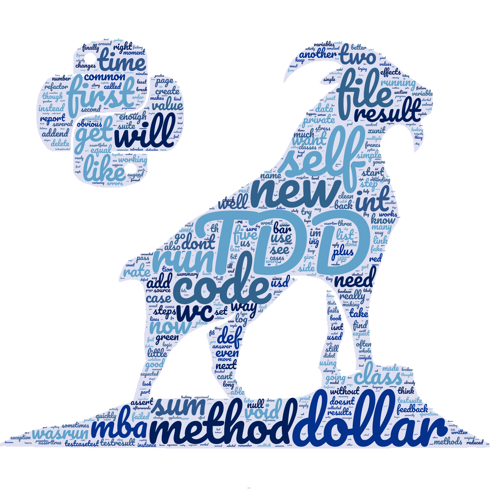

# Programação e Desenvolvimento Dirigidor por Testes em Python

Sejam bem vindos ao curso de **Programação e Desenvolvimento Dirigido por Testes em Python**. 

Este livro é parte de uma iniciativa de desenvolvimento de material de treinamento, ensino e aprendizagem, desenvolvido ao longo de 2021, para a disciplina **ESBD2 - Programação e Desenvolvimento Dirigido por Testes**, ministrada no módulo do curso de [MBA Machine Learning in Production](https://iti.ufscar.mba/mlp) do [ITI-UFSCar](https://iti.ufscar.mba/). 

A intenção é que seja um livro desenvolvido a várias mãos e, do mesmo modo, seja também atualizado a cada ano ou a cada nova oferta da disciplina.

Ao longo deste livro você deve aprender o que é _Test Driven Development_ \(TDD\) e como empregar essa técnica de desenvolvimento no contexto da linguagem de programação [Python](https://www.python.org/).

Considera-se que a atualização de livros que façam extenso uso de tecnologias fundamental para o seu sucesso. Essa é outra razão pelo qual esse livro é redigido on-line e disponibilizado livremente desta forma. Com isso, todo e qualquer interessado no tema pode não apenas usufruir de seu conteúdo, mas também contribuir com o mesmo, se assim o desejar.

Para mais informações sobre o processo de escrita e/ou participação, os interessados podem contactar [auri@ufscar.br](mailto:auri@ufscar.br).

